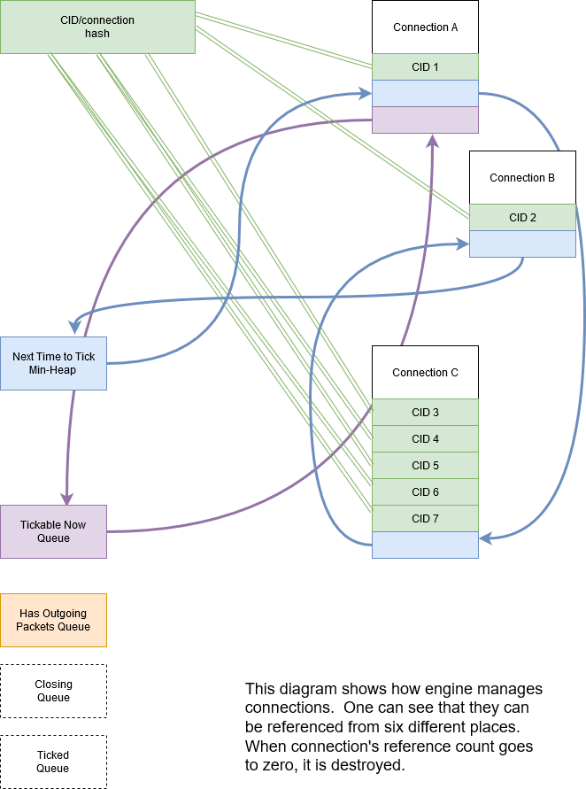
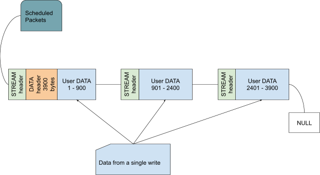
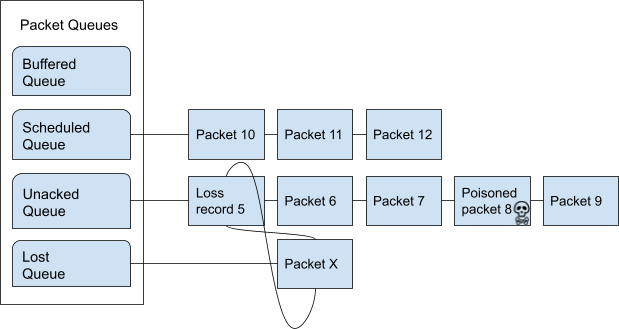
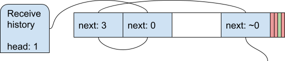

############
Library Guts
############

.. highlight:: c

Introduction
************

lsquic inception dates back to the fall of 2016. Since that time, lsquic
underwent several major changes. Some of those had to do with making the
library more performant; others were needed to add important new
functionality (for example, IETF QUIC and HTTP/3). Throughout this time,
one of the main principles we embraced is that **performance trumps
everything else**, including code readability and maintainability. This
focus drove code design decisions again and again and it explains some
of the hairiness that we will come across in this document.

Code Version
============

The code version under discussion is v2.29.6.

Coding Style
************

Spacing and Cuddling
====================

lsquic follows the LiteSpeed spacing and cuddling conventions:

-  Two empty lines between function definitions

-  Four-space indentation

-  Ifs and elses are not cuddled

Function Name Alignment
=======================

In function definitions, the name is always left-aligned, for example:

::

    static void
    check_flush_threshold (lsquic_stream_t *stream)

Naming Conventions
==================

-  Struct members usually have prefixes derived from the struct name.
   For example members of ``struct qpack_dec_hdl`` begin with ``qdh_``,
   members of ``struct cid_update_batch`` begin with ``cub_``, and so on.
   This is done to reduce the need to memorize struct member names as
   vim's autocomplete (Ctrl-P) functionality makes it easy to fill in
   the needed identifier.

-  Non-static functions all begin with ``lsquic_``.

-  Functions usually begin with a module name (e.g. ``lsquic_engine_`` or
   ``stream_``) which is then followed by a verb (e.g.
   ``lsquic_engine_connect`` or ``stream_activate_hq_frame``). If a
   function does not begin with a module name, it begins with a verb
   (e.g. ``check_flush_threshold`` or ``maybe_remove_from_write_q``).

-  Underscores are used to separate words (as opposed to, for example,
   theCamelCase).

Typedefs
========

Outside of user-facing API, structs, unions, and enums are not
typedefed. On the other hand, some integral types are typedefed.

List of Common Terms
********************

-  **gQUIC** Google QUIC. The original lsquic supported only Google
   QUIC. gQUIC is going to become obsolete. (Hopefully soon).

-  **HQ** This stands for "HTTP-over-QUIC", the original name of HTTP/3.
   The code predates the official renaming to HTTP/3 and thus there
   are many types and names with some variation of ``HQ`` in them.

-  **iQUIC** This stands for IETF QUIC. To differentiate between gQUIC
   and IETF QUIC, we use ``iquic`` in some names and types.

-  **Public Reset** In the IETF QUIC parlance, this is called the *stateless*
   reset.  Because gQUIC was first to be implemented, this name is still
   used in the code, even when the IETF QUIC stateless reset is meant.
   You will see names that contain strings like "prst" and "pubres".

High-Level Structure
********************

At a high level, the lsquic library can be used to instantiate an engine
(or several engines). An engine manages connections; each connection has
streams. Engine, connection, and stream objects are exposed to the user
who interacts with them using the API (see :doc:`apiref`). All other data
structures are internal and are hanging off, in one way or another, from
the engine, connection, or stream objects.

Engine
******

*Files: lsquic_engine.c, lsquic_engine_public.h, lsquic.h*

Data Structures
===============

out_batch
---------

::

    /* The batch of outgoing packets grows and shrinks dynamically */
    /* Batch sizes do not have to be powers of two */
    #define MAX_OUT_BATCH_SIZE 1024
    #define MIN_OUT_BATCH_SIZE 4
    #define INITIAL_OUT_BATCH_SIZE 32

    struct out_batch
    {
        lsquic_conn_t           *conns  [MAX_OUT_BATCH_SIZE];
        struct lsquic_out_spec   outs   [MAX_OUT_BATCH_SIZE];
        unsigned                 pack_off[MAX_OUT_BATCH_SIZE];
        lsquic_packet_out_t     *packets[MAX_OUT_BATCH_SIZE * 2];
        struct iovec             iov    [MAX_OUT_BATCH_SIZE * 2];
    };

The array of struct lsquic_out_specs -- outs above -- is what gets
passed to the user callback ``ea_packets_out()``. ``conns`` array corresponds
to the spec elements one to one.

``pack_off`` records which packet in ``packets`` corresponds to which
connection in ``conns``. Because of coalescing, an element in ``outs`` can
correspond (logically) to more than one packet. (See how the batch is
constructed in `Batching packets`_.) On the
other hand, ``packets`` and ``iov`` arrays have one-to-one correspondence.

There is one instance of this structure per engine: the whole thing is
allocated as part of `struct lsquic_engine <#lsquic-engine>`__.

cid_update_batch
----------------

::

    struct cid_update_batch
    {
        lsquic_cids_update_f    cub_update_cids;
        void                   *cub_update_ctx;
        unsigned                cub_count;
        lsquic_cid_t            cub_cids[20];
        void                   *cub_peer_ctxs[20];
    };

This struct is used to batch CID updates.

There are three user-defined CID liveness callbacks: ``ea_new_scids``,
``ea_live_scids``, and ``ea_old_scids``. These functions all have the same
signature, ``lsquic_cids_update_f``. When the batch reaches the count of
20 (kept in ``cub_count``), the callback is called.

The new SCIDs batch is kept in `struct
lsquic_engine <#lsquic-engine>`__. Other batches are allocated on the
stack in different functions as necessary.

20 is an arbitrary number.

lsquic_engine_public
--------------------

This struct, defined in lsquic_engine_public.h, is the "public"
interface to the engine. ("Public" here means accessible by other
modules inside lsquic, not that it's a public interface like the
:doc:`apiref`.) Because there are many things in the engine object that
are accessed by other modules, this struct is used to expose those
(``public``) parts of the engine.

``lsquic_engine_struct`` is the first member of
`lsquic_engine <#lsquic-engine>`__. The functions declared in
lsquic_engine_public.h take a pointer to lsquic_engine_public as the
first argument, which is then case to lsquic_engine.

This is somewhat ugly, but it's not too bad, as long as one remembers
that the two pointers are interchangeable.

lsquic_engine
-------------

This is the central data structure. The engine instance is the root of
all other data structures. It contains:

-  Pointers to connections in several lists and hashes (see `Connection Management <#connection-management>`__)

-  Memory manager

-  Engine settings

-  Token generator

-  CID Purgatory

-  Server certificate cache

-  Transport parameter cache

-  Packet request queue

-  `Outgoing packet batch <#out-batch>`__

-  And several other things

Some of the members above are stored in the ``pub`` member of type
`lsquic_engine_public <#lsquic-engine-public>`__. These are accessed
directly from other parts of lsquic.

The engine is instantiated via ``lsquic_engine_new()`` and destroyed via
``lsquic_engine_destroy()``

Connection Management
=====================

Lifetime
--------

There are several `connection types`_. All types of
connections begin their life inside the engine module, where their
constructors are called. They all also end their life here as well: this
is where the destructors are called.

The connection constructors are all different function calls:

-  lsquic_ietf_full_conn_client_new

-  lsquic_gquic_full_conn_client_new

-  lsquic_ietf_full_conn_server_new

-  lsquic_gquic_full_conn_server_new

-  lsquic_mini_conn_ietf_new

-  lsquic_mini_conn_new

-  lsquic_prq_new_req

-  lsquic_prq_new_req_ext

(See `Evanescent Connection`_ for information about the last two.)

After a connection is instantiated, all further interactions with it,
including destruction, are done via the `Common Connection Interface`_.

Refcounting Model
-----------------

Each connection is referenced by at least one of the following data
structures:

1. CID-to-connection hash. This hash is used to find connections in
   order to dispatch an incoming packet. Connections can be hashed by
   CIDs or by address. In the former case, each connection has one or
   more mappings in the hash table. IETF QUIC connections have up to
   eight (in our implementation) source CIDs and each of those would
   have a mapping. In client mode, depending on QUIC versions and
   options selected, it is may be necessary to hash connections by
   address, in which case incoming packets are delivered to
   connections based on the address.

2. Outgoing queue. This queue holds connections that have packets to
   send.

3. `Tickable Queue`_. This queue holds connections
   that `can be ticked now <#tickability>`__.

4. `Advisory Tick Time Queue`_.

5. Closing connections queue. This is a transient queue -- it only
   exists for the duration of
   `process_connections() <#processing-connections>`__ function call.

6. Ticked connections queue. Another transient queue, similar to the
   above.

The idea is to destroy the connection when it is no longer referenced.
For example, a connection tick may return TICK_SEND|TICK_CLOSE. In that
case, the connection is referenced from two places: (2) and (5). After
its packets are sent, it is only referenced in (5), and at the end of
the function call, when it is removed from (5), reference count goes to
zero and the connection is destroyed. (See function ``destroy_conn``.) If
not all packets can be sent, at the end of the function call, the
connection is referenced by (2) and will only be removed once all
outgoing packets have been sent.

In the diagram above, you can see that the CID-to-connection hash has
several links to the same connection. This is because an IETF QUIC
connection has more than one Source Connection IDs (SCIDs), any of which
can be included by the peer into the packet. See ``insert_conn_into_hash``
for more details.

References from each of these data structures are tracked inside the
connection object by bit flags:

::

    #define CONN_REF_FLAGS  (LSCONN_HASHED          \
                            |LSCONN_HAS_OUTGOING    \
                            |LSCONN_TICKABLE        \
                            |LSCONN_TICKED          \
                            |LSCONN_CLOSING         \
                            |LSCONN_ATTQ)

Functions ``engine_incref_conn`` and ``engine_decref_conn`` manage setting
and unsetting of these flags.

Notable Code
============

Handling incoming packets
-------------------------

Incoming UDP datagrams are handed off to the lsquic library using the
function ``lsquic_engine_packet_in``. Depending on the engine mode --
client or server -- the appropriate `packet
parsing <#parsing-packets>`__ function is selected.

Because a UDP datagram can contain more than one QUIC packet, the
parsing is done in a loop. If the first part of packet parsing is
successful, the internal ``process_packet_in`` function is called.

There, most complexity is contained in ``find_or_create_conn``, which gets
called for the server side. Here, parsing of the packet is finished, now
via the version-specific call to ``pf_parse_packet_in_finish``. If
connection is not found, it may need to be created. Before that, the
following steps are performed:

-  Check that engine is not in the cooldown mode

-  Check that the maximum number of mini connections is not exceeded

-  Check that the (D)CID specified in the packet is not in the `CID Purgatory`_

-  Check that the packet can be used to create a mini conn: it contains
   version information and the version is supported

-  Depending on QUIC version, perform token verification, if necessary

Only then does the mini connection constructor is called and the
connection is inserted into appropriate structures.

Processing connections
----------------------

Connections are processed in the internal function
``process_connections``. There is the main connection processing loop and
logic.

All connections that the iterator passed to this function returns are
processed in the first while loop. The ``ci_tick()`` call is what causes
the underlying connection to do all it needs to (most importantly,
dispatch user events and generate outgoing packets). The return value
dictates what lists -- global and local to the function -- the
connection will be placed upon.

Note that mini connection promotion happens inside this loop. Newly
created full connections are processed inside the same while loop. For a
short time, a mini and a full connection object exist that are
associated with the same logical connection.

After all connections are ticked, outgoing packets, if there are any,
`are sent out <#batching-packets>`__.

Then, connections that were closed by the first while loop above are
finally closed.

Connections that were ticked (and not closed) are either:

-  Put back onto the ``tickable`` queue;

-  Added to the `Advisory Tick Time Queue`_; or

-  Left unqueued. This can happen when both idle and ping timer are
   turned off. (This should not happen for the connections that we
   expect to process, though.)

And lastly, CID liveness updates are reported to the user via the
optional SCIDs callbacks: ``ea_new_scids`` etc.

Tickable Queue Cycle
--------------------

When a connection is ticked, it is removed from the `Tickable
Queue <#tickable-queue>`__ and placed onto the transient Ticked Queue.
After outgoing packets are sent and some connections are closed, the
Ticked Queue is examined: the engine queries each remaining connection
again whether it's tickable. If it is, back onto the Tickable Queue it
goes. This should not happen often, however. It may occur when RTT is
low and there are many connections to process. In that case, once all
connections have been processed, the pacer now allows to send another
packet because some time has passed.

Batching packets
----------------

Packet-sending entry point is the function ``send_packets_out``. The main
idea here is as follows:

Iterate over connections that have packets to send (those are on the
Outgoing queue in the engine). For each connection, ask it for the next
outgoing packet, encrypt it, and place it into the batch. When the batch
is full, `send the batch <#sending-a-batch>`__.

The outgoing packets from all connections are interleaved. For example,
if connections A, B, and C are on the Outgoing queue, the batch will
contain packets A1, B1, C1, A2, B2, C2, A3, B3, C3, … and so on. This is
done to ensure fairness. When a connection runs out of packets to send,
it returns NULL and is removed from the iterator.

The idea is simple, but the devil is in the details. The code may be
difficult to read. There are several things going on:

Conns Out Iterator
^^^^^^^^^^^^^^^^^^

This iterator, ``conns_out_iter``, sends packets from connections on the
Outgoing queue and packets on the Packet Request queue. (The latter
masquerade as `Evanescent Connections <#evanescent-connection>`__ so that they
are simple to use.) First, the Outgoing queue (which is a min-heap) is
drained. Then, packets from the Packet Request queue are sent, if there
are any. Then, remaining connections from the first pass are returned in
the round-robin fashion.

After sending is completed, the connections that still have outgoing
packets to send are placed back onto the Outgoing queue.

Packet Coalescing
^^^^^^^^^^^^^^^^^

Some IETF QUIC packets can be coalesced. This reduces the number of UDP
datagrams that need to be sent during the handshake. To support this, if
a packet matches some parameters, the same connection is queried for
another packet, which, if it returns, is added to the current batch
slot's iov.

::

    if ((conn->cn_flags & LSCONN_IETF)
        && ((1 << packet_out->po_header_type)
          & ((1 << HETY_INITIAL)|(1 << HETY_HANDSHAKE)|(1 << HETY_0RTT)))
        && (engine->flags & ENG_COALESCE)
        && iov < batch->iov + sizeof(batch->iov) / sizeof(batch->iov[0]))
    {
        const struct to_coal to_coal = {
            .prev_packet = packet_out,
            .prev_sz_sum = iov_size(packet_iov, iov),
        };
        packet_out = conn->cn_if->ci_next_packet_to_send(conn, &to_coal);
        if (packet_out)
            goto next_coa;
    }
    batch->outs   [n].iovlen = iov - packet_iov;

*With some debug code removed for simplicity*

Also see the description of the batch in `out_batch`_.

Note that packet coalescing is only done during the handshake of an IETF
QUIC connection. Non-handshake and gQUIC packets cannot be coalesced.

Sending and Refilling the Batch
^^^^^^^^^^^^^^^^^^^^^^^^^^^^^^^

When the batch is sent inside the while loop, and the whole batch was
sent successfully, the batch pointers are reset, the batch potentially
grows larger, and the while loop continues.

Batch Resizing
^^^^^^^^^^^^^^

When all datagrams in the batch are sent successfully, the batch may
grow -- up to the hardcoded maximum value of ``MAX_OUT_BATCH_SIZE``. When
not all datagrams are sent, the batch shrinks. The batch size survives
the call into the library: when packets are sent again, the same batch
size is used to begin the sending.

Deadline Checking
^^^^^^^^^^^^^^^^^

This is a rather old safety check dating back to the summer of 2017,
when we first shipped QUIC support. The way we send packets has changed
since then -- there is high possibility that this code can be removed
with no ill effect.

Sending a batch
---------------

When the batch is filled, it is handed off to the function ``send_batch``,
which calls the user-supplied callback to send packets out. The
high-level logic is as follows:

-  Update each packet's ``sent`` time

-  Call the "send packets out" callback

-  For packets that were sent successfully, call ``ci_packet_sent``

-  For packets that were not sent, call ``ci_packet_not_sent``. This is
   important: all packets returned by ``ci_next_packet_to_send`` must
   be returned to the connection via either these two calls above or
   via ``ci_packet_too_large`` (see below).

-  Return the number of packets sent

Because of support for coalescing, we have to map from outgoing spec to
packets via ``batch->pack_off``. This is done in several places in this
function.

To handle the case when a PMTU probe is too large (stuff happens!), the
code checks for EMSGSIZE and returns the packet back to the connection
via ``ci_packet_too_large``. Because this error is of our own making, this
does not count as inability to send. The too-large packet is skipped and
sending of the datagrams in the batch continues.

Growing min-heaps
-----------------

The Outgoing and Tickable connection queues are actually min-heaps. The
number of elements in these min-heaps never exceeds the number of
connections. As optimization, allocation of the underlying arrays is
done not in the min-heap module itself but in the engine module in the
function ``maybe_grow_conn_heaps``. The engine knows how many connections
there are and it grows the arrays as necessary.

As an additional optimization, the two arrays use a single memory region
which is allocated once.

The min-heap arrays are never shrunk.

Connection
**********

*Files: lsquic_conn.h, lsquic_conn.c -- others are covered in dedicated
chapters*

The connection represents the QUIC connection. Connections are `managed
by the engine <#connection-management>`__. A connection, in turn,
manages `streams <#stream>`__.

Connection Types
================

lsquic supports two different QUIC protocols: Google QUIC and IETF QUIC.
Each of these has a separate implementation, which includes connection
logic, parsing/generating mechanism, and encryption.

Each of the QUIC connection types on the server begin their life as a
``mini`` connection. This connection type is used while handshake is
proceeding. Once the handshake has completed, the mini connection is
``promoted`` to a ``full`` connection. (See `Mini vs Full
Connection <#mini-vs-full-connections>`__ for more.)

In addition to the above, an "evanescent" connection type is used to
manage replies to incoming packets that do not result in connection
creation. These include version negotiation, stateless retry, and
stateless reset packets.

Each of the five connection types above are covered in their own
dedicated chapters elsewhere in this document:

-  `Mini gQUIC Connection <#mini-gquic-connection>`__

-  `Full gQUIC Connection <#full-gquic-connection>`__

-  `Mini IETF QUIC Connection <#mini-ietf-connection>`__

-  `Full IETF QUIC Connection <#full-ietf-connection>`__

-  `Evanescent Connection <#evanescent-connection>`__

lsquic_conn
===========

All connection types expose the same connection interface via a pointer
to ``struct lsquic_conn``. (This is the same type pointer to which is
exposed to the user, but the user can only treat the connection as an
opaque pointer.)

This structure contains the following elements:

Pointers to Crypto Implementation
---------------------------------

The crypto session pointer, ``cn_enc_session``, points to a type-specific
(gQUIC or iQUIC) instance of the encryption session. This session
survives `connection promotion <#connection-promotion>`__.

The two types of crypto session have a set of common functionality; it
is pointed to by ``cn_esf_c`` (where ``c`` stands for ``common``). Each of
them also has its own, type-specific functionality, which is pointed to
by ``cn_esf.g`` and ``cn_esf.i``

Pointer to Common Connection Interface
--------------------------------------

``cn_if`` points to the set of functions that implement the Common
Connection Interface (`see below <#common-connection-interface>`__).

Pointer to Parsing Interface
----------------------------

The parsing interface is version-specific. It is pointed to by ``cn_pf``.

Various list and heap connectors
--------------------------------

A connection may be pointed to by one or several queues and heaps (see
"\ `Connection Management <#connection-management>`__\ "). There are
several struct members that make it possible: \*TAILQ_ENTRYs,
``cn_attq_elem``, and ``cn_cert_susp_head``.

Version
-------

``cn_version`` is used to make some decisions in several parts of the
code.

Flags
-----

The flags in ``cn_flags`` specify which lists the connection is on and
some other properties of the connection which need to be accessible by
other modules.

Stats
-----

``cn_last_sent`` and ``cn_last_ticked`` are used to determine the
connection's place on the outgoing queue (see `Batching
Packets <#batching-packets>`__) and on the `Advisory Tick Time
Queue <#alarm-set>`__.

List of SCIDs
-------------

IETF QUIC connections have one or more SCIDs (Source Connection IDs),
any one of which can be used by the peer as the DCID (Destination CID)
in the packets it sends. Each of the SCIDs is used to hash the
connection so it can be found. ``cn_cces`` points to an array of size
``cn_n_cces`` which is allocated internally inside each connection type.

Google QUIC connections use only one CID (same for source and
destination). In order not to modify old code, the macro ``cn_cid`` is
used.

Common Connection Interface
===========================

The struct ``conn_iface`` defines the common connection interface. All
connection types implement all or some of these functions.

Some of these functions are used by the engine; others by other modules
(for example, to abort a connection); yet others are for use by the
user, e.g. ``lsquic_conn_close`` and others in lsquic.h. In that case,
these calls are wrapped in lsquic_conn.c.

Tickability
===========

A connection is processed when it is tickable. More precisely, the
connection is placed onto the `Tickable Queue <#tickable-queue>`__,
which is iterated over when `connections are
processed <#processing-connections>`__. A connection reports its own
tickability via the ``ci_is_tickable`` method.

In general, a connection is tickable if it has productive user callbacks
to dispatch (that is, user wants to read and there is data to read or
user wants to write and writing is possible), if there are packets to
send or generate, or if its advisory tick time is in the past. (The
latter is handled in ``lsquic_engine_process_conns()`` when expired
connections from the `Advisory Tick Time Queue`_ are added
to the Tickable Queue.)

Stream
******

*Files: lsquic_stream.h, lsquic_stream.c*

Overview
========

The lsquic stream is the conduit for data. This object is accessible by
the user via any of the ``lsquic_stream_*`` functions declared in
lsquic.h. The stream is bidirectional; in our user code, it represents
the HTTP request and response. The client writes its request to the
stream and the server reads the request in its corresponding instance of
the stream. The server sends its response using the same stream, which
the client reads from the stream.

Besides streams exposed to the application, connections use streams
internally:

-  gQUIC has the HANDSHAKE and HEADERS streams

-  IETF QUIC has up to four HANDSHAKE streams

-  HTTP/3 has at least three unidirectional streams:

   -  Settings stream

   -  QPACK encoder stream

   -  QPACK decoder stream

In addition, HTTP/3 push promises use unidirectional streams. In the
code, we make a unidirectional stream simply by closing one end in the
constructor.

All of the use cases above are handled by the single module,
lsquic_stream. The differences in behavior -- gQUIC vs IETF QUIC, HTTP
vs non-HTTP -- are handled either by explicit conditionals or via
function pointers.

The streams hang off full connections via stream ID-to-stream hashes and
in various queues. This is similar to the way the connections hang off
the engine.

Streams are only used in the full connections; mini connections use
their own, minimalistic, code to handle streams.

.. _data-structures-1:

Data Structures
===============

stream_hq_frame
---------------

This structure is used to keep information about an HTTP/3 frame that is
being, or is about to be, written. In our implementation, frame headers
can be two or three bytes long: one byte is HTTP/3 frame type and the
frame length is encoded in 1 or 2 bytes, giving us the maximum payload
size of 2\ :sup:`14` - 1 bytes. You will find literal ``2`` or ``3`` values
in code that deals with writing HQ frames.

If the HQ frame's size is known in advance (SHF_FIXED_SIZE) -- which is
the case for HEADERS and PUSH_PROMISE frames -- then the HQ header
contents are written immediately. Otherwise, ``shf_frame_ptr`` points to
the bytes in the packet where the HQ header was written, to be filled in
later.

See `Writing HTTP/3 Streams`_ for more information.

hq_filter
---------

This structure is used to read HTTP/3 streams. A single instance of it
is stored in the stream in ``sm_hq_filter``. The framing is removed
transparently (see `Reading HTTP/3 Streams`_).

Frame type and length are read into ``hqfi_vint2_state``. Due to greasing,
the reader must be able to support arbitrary frame types and so the code
is pretty generic: varints of any size are supported.

``hqfi_flags`` and ``hqfi_state`` contain information needed to resume
parsing the frame header, as only partial data may have arrived.

``hqfi_hist_buf`` and ``hqfi_hist_idx`` are used to record the last few
incoming headers. This information is used to check for validity, as
some sequences of HTTP/3 frames are invalid.

stream_filter_if
----------------

This struct is used to specify functionality required to strip arbitrary
framing when reading from the stream. At the moment (and for the
foreseeable future) only one mechanism is used: that to strip the HTTP/3
framing. At the time the code was written, however, the idea was to
future-proof it in case we needed to support more than one framing format
at a time.

lsquic_stream
-------------

This struct is the stream object. It contains many members that deal
with

-  Reading data

-  Writing data

-  Maintaining stream list memberships

-  Enforcing flow control

-  Dispatching read and write events

-  Calling various user callbacks

-  Interacting with HEADERS streams

The stream has an ID (``id``). It is used to hash the stream.

A stream can be on one or more lists: see ``next_send_stream``,
``next_read_stream``, and so on.

Incoming data is stored in ``data_in``. Outgoing data is packetized
immediately or buffered in ``sm_buf``.

HTTP/3 frames that are being actively written are on the ``sm_hq_frames``
list.

A note on naming: newer members of the stream begin with ``sm_`` for
simplicity. Originally, the structure members lacked a prefix.

progress
--------

This structure is used to determine whether the user callback has made
any progress during an ``on_write`` or ``on_read`` event loop. If progress
is not made for a number of calls, the callback is interrupted, breaking
out of a suspected infinite loop. (See ``es_progress_check`` setting.)

frame_gen_ctx
-------------

This structure holds function pointers to get user data and write it to
packets. ``fgc_size``, ``fgc_fin``, and ``fgc_read`` are set based on framing
requirements. This is a nice abstraction that gets passed to several
packetization functions and allows them not to care about how or whether
framing is performed.

pwritev_ctx
-----------

Used to aid ``lsquic_stream_pwritev``. ``hq_arr`` is used to roll back
HTTP/3 framing if necessary. (The rollback is the most complicated part
of the ``pwritev`` functionality).

Event Dispatch
==============

The "on stream read" and "on stream write" callbacks are part of the
lsquic API. These callbacks are called when the user has registered
interest in reading from or writing to the stream and reading or writing
is possible.

Calling ``lsquic_stream_wantwrite`` and ``lsquic_stream_wantread`` places
the stream on the corresponding "want to write" and "want to read" list.
These lists are processed by a connection when it's ticked. For each
stream on the list, the internal function
``lsquic_stream_dispatch_read_events`` or
``lsquic_stream_dispatch_write_events``, whichever may be the case.

Dispatching read events is simple. When ``es_rw_once`` is set, the "on
stream read" callback is called once -- if the stream is readable.
Otherwise, the callback is called in a loop as long as:

-  The stream is readable;

-  The user wants to read from it; and

-  Progress is being made

Dispatching write events is more complicated due to the following
factors:

-  In addition to calling the "on stream write" callback, the flushing
   mechanism also works by using the "want to write" list.

-  When writing occurs, the stream's position on the list may change

STREAM frames in
================

The data gets in from the transport into the stream via
``lsquic_stream_frame_in`` function. The connection calls this function
after parsing a STREAM frame.

The data from the STREAM frame is stored in one of the two "data in"
modules: ``di_nocopy`` and ``di_hash``. The two are abstracted out behind
``stream->data_in``.

The "data in" module is used to store incoming stream data. The data is
read from this module using the ``di_get_frame`` function. See the next
section.

Reading Data
============

There are three user-facing stream-reading functions; two of them are
just wrappers around ``"lsquic_stream_readf``. This function performs some
checks (we will cover HTTP mode separately) and calls
``lsquic_stream_readf``, which also performs some checks and calls
``read_data_frames``. This is the only function in the stream module where
data is actually read from the "data in" module.

Writing Data
============

There are four user-facing functions to write to stream, and all of them
are wrappers around ``stream_write``. (``lsquic_stream_pwritev`` is a bit
more involved than the other three, but it's pretty well-commented --
and the complexity is in the rollback, not writing itself.)

Small writes get buffered. If the write size plus whatever is buffered
already exceeds the threshold -- which is the size of the largest STREAM
frame that could be fit into a single outgoing packet -- the data is
packetized instead by calling ``stream_write_to_packets``. See the next
section.

Packetization
=============

``stream_write_to_packets`` is the only function through which user data
makes it into outgoing packets. There are three ways to write STREAM
frames:

1. ``stream_write_to_packet_hsk``

2. ``stream_write_to_packet_std``

3. ``stream_write_to_packet_crypto``

The particular function is selected based on connection and stream type
when the stream is first created.

stream_write_to_packets
-----------------------

Depending on the need to frame data, a reader is selected. The job of
the reader is to copy user data into the outgoing STREAM frame. In
HTTP/3 mode, HTTP/3 framing is added transparently -- see `Writing
HTTP/3 Streams`_ for more information.

The while loop is entered if there is user data to be copied or if the
end of the stream has been reached and FIN needs to be written. Note the
threshold check: when writing data from a user call, the threshold is
set and frames smaller than the full packet are not generated. This is
to allow for usage like "write 8KB", "write 8KB", "write 8KB" not to
produce jagged STREAM frames. This way, we utilize the bandwidth most
effectively. When flushing data, the threshold is not set, so even a
1-byte data gets packetized.

The call ``stream->sm_write_to_packet`` writes data to a single packet.
This packet is allocated by the `Send Controller <#send-controller>`__.
(Depending on when writing is performed, the returned packet may be
placed onto the scheduled queue immediately or it may be a "buffered"
packet. The stream code is oblivious to that.) If the send controller
does not give us a packet, STOP is returned and the while loop exits. An
ERROR should never happen -- this indicates a bug or maybe failure to
allocate memory -- and so the connection is aborted in that case. If
everything is OK, the while loop goes on.

The ``seen_ok`` check is used to place the connection on the tickable list
on the first successfully packetized STREAM frame. This is so that if
the packet is buffered (meaning that the writing is occurring outside of
the callback mechanism), the connection will be processed (ticked) and
the packets will be scheduled and sent out.

After the while loop, we conditionally close an outstanding HTTP/3
frame, save any leftover data, schedule STREAM_BLOCKED or BLOCKED frames
to be sent out if needed, and return the number of user-provided bytes
that were copied into the outgoing packets and into the internal stream
buffer (leftovers).

Write a single STREAM frame
---------------------------

We will examine ``stream_write_to_packet_std`` as it is the most
complicated of these three functions.

First, we flush the headers stream if necessary -- this is because we
want the HTTP (gQUIC or HTTP/3) headers to be sent before the payload.

Then, the number of bytes needed to generate a STREAM frame is
calculated. This value depends on the QUIC version, whether we need to
generate HTTP/3 framing, and whether the data to write exists (or we
just need to write an empty STREAM frame with the FIN bit set).

(Note that the framing check is made to overshoot the estimate for
simplicity. For one, we might not need 3 bytes for the DATA frame, but
only 2. Secondly, there may already be an open HTTP/3 frame in one of
the previous packets and so we don't need to write it at all.)

Then, a packet is allocated and ``write_stream_frame`` is called. It is in
this function that we finally make the call to generate the STREAM frame
and to copy the data from the user. The function ``pf_gen_stream_frame``
returns the number of bytes actually written to the packet: this
includes both the STREAM frame header and the payload (which may also
include HTTP/3 frame).

The fact that this frame type has been written is added to
``po_frame_types`` and the STREAM frame location, type, and size are
recorded. This information is necessary to be able to elide the frame
from the packet in case the stream is reset.

``PO_STREAM_END`` is set if the STREAM frame extends to the end of the
packet. This is done to prevent this packet from being used again to
append frames to it (after, for example, some preceding frames are
elided from it). This is because both in gQUIC and IETF QUIC the STREAM
frame header is likely to omit the ``length`` field and instead use the
"extends to the end of the packet" field. If frames are shifted, the
packet cannot be appended to because it will lead to data loss and
corruption.

Writing HTTP/3 Streams
======================

HTTP/3 streams use framing. In most cases, a single HEADERS frame is
followed by zero or more DATA frames. The user code does not know this:
both gQUIC and IETF QUIC streams appear to behave in exactly the same
manner. This makes lsquic simple to use.

The drawback is internal complexity. To make the code both easy to use
and performant, HTTP/3 framing is generated on-the-fly, as data is being
written to packets (as opposed to being buffered and then written). (OK,
*mostly* on-the-fly: the HEADERS frame payload is generated and then
copied.)

On the high level, the way it works is as follows:

-  When a write call is made, a variable-size (that is, unknown size;
   it's called variable-size because the size of the DATA header may
   be 2 or 3 bytes; it's not the best name in the world) frame is
   opened/activated.

-  When data is written to stream, the DATA header placeholder bytes are
   written to the stream transparently and a pointer is saved to this
   location.

-  The active frame header is closed when

   -  It reaches its maximum size; or

   -  The data we are writing runs out.

-  When the header is closed, the number of bytes that follows is now
   written to the location we saved when the header was activated.

This mechanism allows us to create a DATA frame that spans several
packets before we know how many packets there will be in a single write.
(As outgoing packet allocation is governed by the `Send Controller`_.)
This is done to minimize the goodput overhead incurred by the DATA frame header.

There are a couple of things that do not fit into this model:

1. The HEADERS frame is fixed size [1]_. It is generated separately
   (written by QPACK encoder into a buffer on the stack) and later
   copied into the stream. (See the ``send_headers_ietf`` function.) It
   can happen that the whole buffer cannot be written. In that case,
   a rather complicated dance of buffering the unwritten HEADERS
   frame bytes is performed. Here, the "on stream write" callback is
   replaced with an internal callback (see the ``select_on_write``
   function) and user interaction is prohibited until the whole of
   the HEADERS frame is written to the stream.

2. Push promise streams are even weirder. In addition to the HEADERS
   handling above, the push promise stream must begin with a
   variable-integer Push ID. To make this fit into the framed stream
   model, the code makes up the concept of a "phantom" HTTP/3 frame.
   This type of frame's header is not written. This allows us to
   treat the Push ID as the payload of a regular HTTP/3 frame.

The framing code has had its share of bugs. Because of that, there is a
dedicated unit test program just for the framing code,
*tests/test_h3_framing.c*. In addition to manually-written tests, the
program has a "fuzzer driver" mode, in which the American Fuzzy Lop
fuzzer drives the testing of the HTTP/3 framing mechanism. The advantage
of this approach is that AFL tries to explore all the code paths.

Debates regarding DATA framing raged in 2018 on the QUIC mailing list.
Some of the discussion is quite interesting: for example, the debate about
"optimizing" DATA frames and `calculations of the header
cost <https://lists.w3.org/Archives/Public/ietf-http-wg/2018OctDec/0236.html>`__.

Reading HTTP/3 Streams
======================

HTTP/3 frame headers are stripped out transparently -- they are never
seen by the user. From the user's perspective, the lsquic stream
represents the payload of HTTP message; a dedicated call is made first
to get at the HTTP headers.

To accomplish this, the stream implements a generic deframing mechanism.
The `stream_filter_if`_ interface allows one to
specify functions to a) check whether the stream is readable, b) strip
header bytes from a data frame fetched from "data in" module; and c)
update byte count in the filter once bytes have been read:

hq_filter_readable
------------------

This function tests for availability of non-frame-header data, stripping
frame headers from the stream transparently. Note how it calls
``read_data_frames`` with its own callback, ``hq_read``. It is inside this
callback that the HEADERS frame is fed to the QPACK decoder.

hq_filter_df
------------

This function's job is to strip framing from data frames returned by the
"data in" module inside the ``read_data_frames`` function. It, too, calls
the ``hq_read`` function. This allows the two functions that read from
stream (this one) and the readability-checking function
(``hq_filter_readable``) to share the same state. This is crucial:
Otherwise this approach is not likely to work well.

hq_decr_left
------------

This function is needed to update the filter state. Once all payload
bytes from the frame have been consumed, the filter is readied to strip
the next frame header again.

.. _notable-code-1:

Notable Code
============

frame_hq_gen_read
-----------------

This is where HTTP/3 frame headers are generated. Note the use of
``shf_frame_ptr`` to record the memory location to which the correct frame
size will be written by a different function.

Parsing
*******

*Files: lsquic_parse.h, lsquic_parse_ietf_v1.c, lsquic_parse_Q050.c, lsquic_parse_Q046.c,
lsquic_parse_gquic_be.c, lsquic_parse_common.c, and others*

Overview
========

The two types of QUIC -- gQUIC and IETF QUIC -- have different packet and
frame formats.  In addition, different gQUIC version are different among
themselves.  Functions to parse and generate packets and frames of each
type are abstracted out behind the rather large ``struct parse_funcs``.
When a connection is created, its ``cn_pf`` member is set to point to
the correct set of function pointers via the ``select_pf_by_ver()`` macro.

Parsing Packets
===============

Before settling on a particular set of parsing function for a connection,
the server needs to determine the connection's version.  It does so using
the function ``lsquic_parse_packet_in_server_begin()``.

This function figures out whether the packet has a long or a short header,
and which QUIC version it is.  Because the server deals with fewer packet
types than the client (no version negotiation or stateless retry packets),
it can determine the necessary parsing function from the first byte of the
incoming packet.

The "begin" in the name of the function refers to the fact that packet
parsing is a two-step process [3]_.  In the first step, the packet version,
CID, and some other parameters are parsed out; in the second step,
version-specific ``pf_parse_packet_in_finish()`` is called to parse out
the packet number.  Between the two calls, the state is saved in
``struct packin_parse_state``.

Generating Packets
==================

Packets are generated during encryption using the ``pf_gen_reg_pkt_header()``
function.  The generated header is encrypted together with the `packet payload`_
and this becomes the QUIC packet that is sent out.  (Most of the time, the
QUIC packet corresponds to the UDP datagram, but sometimes packets are
`coalesced <#packet-coalescing>`__.

Parsing Frames
==============

There is a parsing function for each frame type.  These function generally
have names that begin with "pf_parse\_" and follow a similar pattern:

-   The first argument is the buffer to be parsed;

-   The second argument is its size;

-   Any additional arguments are outputs: the parsed out values from the frame;

-   Number of bytes consumed is returned or a negative value is returned
    if a parsing error occurred.

For example:

::

    int
    (*pf_parse_stream_frame) (const unsigned char *buf, size_t rem_packet_sz,
                                                    struct stream_frame *);

    int
    (*pf_parse_max_data) (const unsigned char *, size_t, uint64_t *);

Generating Frames
=================

Functions that generate frames begin with "pf_gen\_" and also follow a
pattern:

-   First argument is the buffer to be written to;

-   The second argument is the buffer size;

-   Any additional arguments specify the values to include in the frame;

-   The size of the resulting frame is returned or a negative value if
    an error occurred.

For example:

::

    int
    (*pf_gen_path_chal_frame) (unsigned char *, size_t, uint64_t chal);

    int
    (*pf_gen_stream_frame) (unsigned char *buf, size_t bufsz,
                            lsquic_stream_id_t stream_id, uint64_t offset,
                            int fin, size_t size, gsf_read_f, void *stream);

Frame Types
===========

Frame types are listed in ``enum quic_frame_type``.  When frames are parsed,
the on-the-wire frame type is translated to the enum value; when frames are
generated, the enum is converted to the on-the-wire format.  This indirection
is convenient, as it limits the range of possible QUIC frame values, making
it possible to store a list of frame types as a bitmask.  Examples include
``po_frame_types`` and ``sc_retx_frames``.

Some frame types, such as ACK and STREAM, are common to both Google and IETF
QUIC.  Others, such as STOP_WAITING and RETIRE_CONNECTION_ID, are only used
in one of the protocols.  The third type is frames that are used by IETF
QUIC extensions, such as TIMESTAMP and ACK_FREQUENCY.

Parsing IETF QUIC Frame Types
-----------------------------

Most IETF frame types are encoded as a single by on the wire (and all Google
QUIC frames are).  Some of them are encoded using multiple bytes.  This is
because, like the vast majority of all integral values in IETF QUIC, the frame
type is encoded as a varint.  Unlike the other integral values, however, the
frame type has the unique property is that it must be encoded using the
*minimal representation*: that is, the encoding must use the minimum number
of bytes possible.  For example, encoding the value 200 must use the two-byte
varint, not four- or eight-byte version.  This makes it possible to parse
frame types once without having to reparse the frame type again in individual
frame-parsing routines.

Frame type is parsed out in ``ietf_v1_parse_frame_type()``.  Because of the
minimal encoding requirement, the corresponding frame-parsing functions know
the number of bytes to skip for type, for example:

::

    static int
    ietf_v1_parse_frame_with_varints (const unsigned char *buf, size_t len,
                const uint64_t frame_type, unsigned count, uint64_t *vals[])
    {
        /* --- 8< --- code removed */
        vbits = vint_val2bits(frame_type);
        p += 1 << vbits;                    // <=== SKIP FRAME TYPE
        /* --- 8< --- code removed */
    }

    static int
    ietf_v1_parse_timestamp_frame (const unsigned char *buf,
                                    size_t buf_len, uint64_t *timestamp)
    {
        return ietf_v1_parse_frame_with_varints(buf, buf_len,
                FRAME_TYPE_TIMESTAMP, 1, (uint64_t *[]) { timestamp });
    }

Mini vs Full Connections
************************

Mini Purpose
============

The reason for having a mini connection is to conserve resources: a mini
connection allocates a much smaller amount of memory. This protects the
server from a potential DoS attack. The mini connection's job is to get
the handshake to succeed, after which the connection is
`promoted <#connection-promotion>`__.

Mini/Full Differences
=====================

Besides their size, the two connection types differ in the following
ways:

Mini connections' lifespan is limited. If the handshake does not succeed
within 10 seconds (configurable), the mini connection is destroyed.

A mini connection is only `tickable <#tickability>`__ if it has unsent
packets.

Mini connections do not process packets that carry application (as
opposed to handshake) data. The 0-RTT packet processing is deferred;
these packets are stashed and handed over to the full connection during
promotion.

Connection Promotion
====================

A mini connection is promoted when the handshake succeeds. The mini
connection reports this via the return status of ``ci_tick`` by setting
the ``TICK_PROMOTE`` bit. The engine creates a new connection object and
calls the corresponding server constructor. The latter copies all the
relevant state information from mini to full connection.

For a time, two connection objects -- one mini and one full -- exist at
the same state. Most of the time, the mini connection is destroyed
within the same function call to ``process_connections()``. If, however,
the mini connection has unsent packets, it will remain live until those
packets are sent successfully. Because the mini connection is by then
removed from the CID-to-connection hash (``engine->conns_hash``), it will
not receive any more incoming packets.

Also see `Connection Processing <#processing-connections>`__.

Mini gQUIC Connection
*********************

*Files: lsquic_mini_conn.h, lsquic_mini_conn.c*

.. _overview-1:

Overview
========

The original version of ``struct mini_conn`` fit into paltry 128 bytes.
The desire to fit into 128 bytes [2]_ led to, for example,
``mc_largest_recv`` -- in effect, a 3-byte integer! Since that time,
the mini conn has grown to over 512 bytes.

Looking at the struct, we can see that a lot of other data structures
are squeezed into small fields:

Received and sent packet history is each packed into a 64-bit integer,
``mc_received_packnos`` and ``mc_sent_packnos``, respectively. The HEADERS
stream offsets are handled by the two two-byte integers ``mc_read_off``
and ``mc_write_off``.

.. _notable-code-2:

Notable Code
============

continue_handshake
------------------

This function constructs a contiguous buffer with all the HANDSHAKE
stream chunks in order and passes it to ``esf_handle_chlo()``. This is
done because the gQUIC crypto module does not buffer anything: it's all
or nothing.

The code has been written in a generic way, so that even
many small packets can be reconstructed into a CHLO. The lsquic client
can be made to split the CHLO by setting the max packet size
sufficiently low.

sent/unsent packets
-------------------

To conserve space, only a single outgoing packet header exists in the
mini connection struct, ``mc_packets_out``. To differentiate between
packets that are to be sent and those that have already been sent, the
``PO_SENT`` flag is used.

Mini IETF Connection
********************

*Files: lsquic_mini_conn_ietf.h, lsquic_mini_conn_ietf.c*

.. _overview-2:

Overview
========

The IETF QUIC mini connection has the same idea as the gQUIC mini
connection: use as little memory as possible. This is more difficult to
do with the IETF QUIC, however, as there are more moving parts in this
version of the protocol.

.. _data-structures-2:

Data Structures
===============

mini_crypto_stream
------------------

This structure is a minimal representation of a stream. The IETF QUIC
protocol uses up to four HANDSHAKE streams (one for each encryption
level) during the handshake and we need to keep track of them. Even a
basic event dispatch mechanism is supported.

packno_set_t
------------

This bitmask is used to keep track of sent, received, and acknowledged
packet numbers. It can support up to 64 packet numbers: 0 through 63. We
assume that the server will not need to send more than 64 packets to
complete the handshake.

imc_recvd_packnos
-----------------

Because the client is allowed to start its packet number sequence with
any number in the [0, 2\ :sup:`32`-1] range, the received packet history
must be able to accommodate numbers larger than 63. To do that, the
receive history is a union. If all received packet numbers are 63 or
smaller, the packno_set_t bitmask is used. Otherwise, the receive
history is kept in `Tiny Receive History <#tiny-receive-history>`__
(trechist). The flag ``IMC_TRECHIST`` indicates which data structure is
used.

ietf_mini_conn
--------------

This structure is similar to the gQUIC mini conn. It is larger, though,
as it needs to keep track of several instances of things based on
encryption level or packet number space.

``imc_cces`` can hold up to three SCIDs: one for the original DCID from
the client, one for SCID generated by the server, and one for when
preferred address transport parameter is used. (The preferred address
functionality is not compiled by default.)

ietf_mini_rechist
-----------------

The receive history is in the header file because, in addition to
generating the ACK frames in the IETF mini conn, it is used to migrate
the receive history during promotion.

.. _notable-code-3:

Notable Code
============

Switching to trechist
---------------------

The switch to the Tiny Receive History happens when the incoming packet
number does not fit into the bitmask anymore -- see
``imico_switch_to_trechist()``. To keep the trechist code exercised, about
one in every 16 mini connection uses trechist unconditionally -- see
``lsquic_mini_conn_ietf_new()``.

crypto_stream_if
----------------

A set of functions to drive reading and writing CRYPTO frames to move
the handshake along is specified. It is passed to the crypto session.
After promotion, the full connection installs its own function pointers.

imico_read_chlo_size
--------------------

This function reads the first few bytes of the first CRYPTO frame on the
first HANDSHAKE stream to figure out the size of ClientHello. The
transport parameters will not be read until the full ClientHello is
available.

Duplicated Code
---------------

Some code has been copied from gQUIC mini connection. This was done on
purpose, with the expectation that gQUIC is going away.

ECN Blackhole Detection
-----------------------

ECN blackhole at the beginning of connection is guessed at when none of
packets sent in the initial batch were acknowledged. This is done by
``imico_get_ecn()``. ``lsquic_mini_conn_ietf_ecn_ok()`` is also used during
promotion to check whether to use ECN.

Connection Public Interface
***************************

*Files: lsquic_conn_public.h*

TODO

Full gQUIC Connection
*********************

*Files: lsquic_full_conn.h, lsquic_full_conn.c*

.. _overview-3:

Overview
========

The full gQUIC connection implements the Google QUIC protocol, both
server and client side. This is where a large part of the gQUIC protocol
logic is contained and where everything -- engine, streams, sending,
event dispatch -- is tied together.

Components
==========

In this section, each member of the ``full_conn`` structure is documented.

fc_conn
-------

The first member of the struct is the common connection object,
`lsquic_conn`_.

It must be first in the struct because the two pointer are cast to each
other, depending on circumstances.

fc_cces
-------

This array holds two connection CID elements.

The reason for having two elements in this array instead of one (even
though gQUIC only uses one CID) is for the benefit of the client: In
some circumstances, the client connections are hashed by the port
number, in which case the second element is used to hash the port value.
The relevant code is in lsquic_engine.c

fc_rechist
----------

This member holds the `packet receive history <#receive-history>`__. It
is used to generate ACK frames.

fc_stream_ifs
-------------

This three-element array holds pointers to stream callbacks and the
stream callback contexts.

From the perspective of lsquic, Google QUIC has three stream types:

1. HANDSHAKE stream;

2. HEADERS stream; and

3. Regular (message, or request/response) streams.

The user provides stream callbacks and the context for the regular
streams (3) in ``ea_stream_if`` and ``ea_stream_if_ctx``.

The other two stream types are internal. The full connection specifies
internal callbacks for those streams. One set handles the handshake and
the other handles reading and writing of HTTP/2 frames: SETTINGS,
HEADERS, and so on.

fc_send_ctl
-----------

This is the `Send Controller <#send-controller>`__. It is used to
allocate outgoing packets, control sending rate, and process
acknowledgements.

fc_pub
------

This member holds the `Connection Public
Interface <#connection-public-interface>`__.

fc_alset
--------

This is the `Alarm Set <#alarm-set>`__. It is used to set various timers
in the connection and the send controller.

fc_closed_stream_ids
--------------------

The two sets in this array hold the IDs of closed streams.

There are two of them because of the uneven distribution of stream IDs.
It is more efficient to hold even and odd stream IDs in separate
structures.

fc_settings
-----------

Pointer to the engine settings.

This member is superfluous -- the settings can be fetched from
``fc_enpub->enp_settings``.

fc_enpub
--------

This points to the `engine's public interface <#lsquic-engine-public>`__.

fc_max_ack_packno
-----------------

Recording the maximum packet number that contained an ACK allows us to
ignore old ACKs.

fc_max_swf_packno
-----------------

This is the maximum packet number that contained a STOP_WAITING frame.
It is used to ignore old STOP_WAITING frames.

fc_mem_logged_last
------------------

This timestamp is used to limit logging the amount of memory used to
most once per second.

fc_cfg
------

This structure holds a few important configuration parameters. (Looks
like ``max_conn_send`` is no longer used…)

fc_flags
--------

The flags hold various boolean indicators associated with the full
connections. Some of them, such as ``FC_SERVER``, never change, while
others change all the time.

fc_n_slack_akbl
---------------

This is the number of ackable (or, in the new parlance, *ack-eliciting*)
packets received since the last ACK was sent.

This counter is used to decide whether an ACK should be sent (or, more
precisely, queued to be sent) immediately or whether to wait.

fc_n_delayed_streams
--------------------

Count how many streams have been delayed.

When ``lsquic_conn_make_stream()`` is called, a stream may not be created
immediately. It is delayed if creating a stream would go over the
maximum number of stream allowed by peer.

fc_n_cons_unretx
----------------

Counts how many consecutive unretransmittable packets have been sent.

fc_last_stream_id
-----------------

ID of the last created stream.

Used to assign ID to streams created by this side of the connection.
Clients create odd-numbered streams, while servers initiate
even-numbered streams (push promises).

fc_max_peer_stream_id
---------------------

Maximum value of stream ID created by peer.

fc_goaway_stream_id
-------------------

Stream ID received in the GOAWAY frame.

This ID is used to reset locally-initiated streams with ID larger than
this.

fc_ver_neg
----------

This structure holds the version negotiation state.

This is used by the client to negotiate with the server.

With gQUIC going away, it is probably not very important anymore.

fc_hsk_ctx
----------

Handshake context for the HANDSHAKE stream.

Client and server have different HANDSHAKE stream handlers -- and
therefore different contexts.

fc_stats
--------

Connection stats

fc_last_stats
-------------

Snapshot of connection stats

This is used to log the changes in counters between calls to
``ci_log_stats()``. The calculation is straightforward in
``lsquic_conn_stats_diff()``.

fc_stream_histories and fc_stream_hist_idx
------------------------------------------

Rolling log of histories of closed streams

fc_errmsg
---------

Error message associated with connection termination

This is set when the connection is aborted for some reason. This error
message is only set once. It is used only to set the error message in
the call to ``ci_status()``

fc_recent_packets
-----------------

Dual ring-buffer log of packet history

The first element is for incoming packets, the second is for outgoing
packets. Each entry holds received or sent time and frame information.

This can be used for debugging. It is only compiled into debug builds.

fc_stream_ids_to_reset
----------------------

List of stream ID to send STREAM_RESET for

These STREAM_RESET frames are associated with streams that are not
allowed to be created because we sent a GOAWAY frame. (There is a period
when GOAWAY is in transit, but the peer keeps on creating streams). To
queue the reset frames for such a stream, an element is added to this
list.

fc_saved_ack_received
---------------------

Timestamp of the last received ACK.

This is used for `ACK merging <#ack-merging>`__.

fc_path
-------

The network path -- Google QUIC only has one network path.

fc_orig_versions
----------------

List (as bitmask) of original versions supplied to the client
constructor.

Used for version negotiation. See `fc_ver_neg`_ for more
coverage of this topic.

fc_crypto_enc_level
-------------------

Latest crypto level

This is for Q050 only, which does away with the HANDSHAKE stream and
uses CRYPTO frames instead. (This was part of Google's plan to move
Google QUIC protocol closer to IETF QUIC.)

fc_ack
------

Saved ACK -- latest or merged

This ACK structure is used in `ACK merging <#ack-merging>`__.

Instantiation
=============

The largest difference between the server and client mode of the full
connection is in the way it is created. The client creates a brand-new
connection, performs version negotiation, and runs the handshake before
dispatching user events. The server connection, on the other hand, gets
created from a mini connection during `connection
promotion <#connection-promotion>`__. By that time, both version
negotiation and handshake have already completed.

Common Initialization
---------------------

The ``new_conn_common()`` function contains initialization common to both
server and client. Most full connection's internal data structures are
initialized or allocated here, among them `Send
Controller <#send-controller>`__, `Receive
History <#receive-history>`__, and `Alarm Set <#alarm-set>`__.

The HEADERS stream is created here, if necessary. (Throughout the code,
you can see checks whether the connection is in HTTP mode or not. Even
though gQUIC means that HTTP is used, our library supports a non-HTTP
mode, in which there is no HEADERS stream. This was done for testing
purposes and made possible the echo and md5 client and server programs.)

Server
------

After initializing the common structures in ``new_conn_common()``,
server-specific initialization continues in
``lsquic_gquic_full_conn_server_new()``.

The HANDSHAKE stream is created. The handler (see
``lsquic_server_hsk_stream_if``) simply throws out data that it reads from
the client.

Outgoing packets are inherited -- they will be sent during the next tick
-- and deferred incoming packets are processed.

Client
------

The client's initialization takes place in
``lsquic_gquic_full_conn_client_new()``. Crypto session is created and the
HANDSHAKE stream is initialized. The handlers in
``lsquic_client_hsk_stream_if`` drive the handshake process.

Incoming Packets
================

The entry point for incoming packets is ``ci_packet_in()``, which is
implemented by ``full_conn_ci_packet_in``. Receiving a packet restarts the
idle timer.

The function ``process_incoming_packet`` contains some client-only logic
for processing version negotiation and stateless retry packets. In the
normal case, ``process_regular_packet()`` is called. This is where the
incoming packet is decrypted, the `Receive
History <#receive-history>`__ is updated, ``parse_regular_packet()`` is
called, and some post-processing takes place (most importantly,
scheduling an ACK to be sent).

The function ``parse_regular_packet`` is simple: It iterates over the
whole decrypted payload of the incoming packet and parses out frames one
by one. An error aborts the connection.

ACK Merging
===========

Processing ACKs is `expensive <#handling-acks>`__. When sending data, a
batch of incoming packets is likely to contain an ACK frame each. The
ACK frame handler, ``process_ack_frame()``, merges consecutive ACK frames
and stores the result in `fc_ack`_. The ACK is processed
during the `next tick <#ticking>`__. If the two ACK cannot be merged
(which is unlikely), the cached ACK is processed immediately and the new
ACK is cached.

Caching an ACK has a non-trivial memory cost: the 4KB-plus data
structure ``ack_info`` accounts for more than half of the size of the
``full_conn`` struct. Nevertheless, the tradeoff is well worth it. ACK
merging reduces the number of calls to ``lsquic_send_ctl_got_ack()`` by a
factor of 10 or 20 in some high-throughput scenarios.

Ticking
=======

When a `connection is processed by the
engine <#processing-connections>`__, the engine calls the connection's
``ci_tick()`` method. This is where most of the connection logic is
exercised. In the full gQUIC connection, this method is implemented by
``full_conn_ci_tick()``.

The following steps are performed:

-  A cached ACK, if it exists, is processed

-  Expired alarms are rung

-  Stream read events are dispatched

-  An ACK frame is generated if necessary

-  Other control frames are generated if necessary

-  Lost packets are rescheduled

-  More control frames and stream resets are generated if necessary

-  HEADERS stream is flushed

-  Outgoing packets that carry stream data are scheduled in four steps:

   a. High-priority `buffered packets <#buffered-queue>`__ are scheduled

   b. Write events are dispatched for high-priority streams

   c. Non-high-priority buffered packets are scheduled

   d. Write events are dispatched for non-high-priority streams

-  Connection close or PING frames are generated if necessary

-  Streams are serviced (closed, freed, created)

Full IETF Connection
********************

*Files: lsquic_full_conn_ietf.h, lsquic_full_conn_ietf.c*

Overview
========

This module implements IETF QUIC
`Transport <https://tools.ietf.org/html/draft-ietf-quic-transport-34>`_
and
`HTTP/3 <https://tools.ietf.org/html/draft-ietf-quic-http-34>`_ logic,
plus several QUIC extensions.  To attain an overall grasp of the code,
at least some familiarity with these protocols is required.  To understand
the code in detail, especially *why* some things are done, a closer reading
of the specification may be in order.

In some places, the code contains comments with references to the
specification, e.g.

::

    if (conn->ifc_flags & IFC_SERVER)
    {   /* [draft-ietf-quic-transport-34] Section 19.7 */
        ABORT_QUIETLY(0, TEC_PROTOCOL_VIOLATION,
                            "received unexpected NEW_TOKEN frame");
        return 0;
    }

(A search for "[draft-ietf" will reveal over one hundred places in the
code thus commented.)

The Full IETF Connection module is similar in structure to the `Full gQUIC
Connection`_ module, from which it originated.  Some code is quite similar
as well, including logic for `ACK Merging`_ and `Ticking`_.

Components
==========

In this section, each member of ``ietf_full_conn`` is documented.

ifc_conn
--------

The first member of the struct is the common connection object,
`lsquic_conn`_.

It must be first in the struct because the two pointer are cast to each
other, depending on circumstances.

ifc_cces
--------

This array holds eight connection CID elements.
See `Managing SCIDs`_.

ifc_rechist
-----------

This member holds the `packet receive history <#receive-history>`__.
The receive history is used to generate ACK frames.

ifc_max_ackable_packno_in
-------------------------

This value is used to detect holes in incoming packet number sequence.
This information is used to queue ACK frames.

ifc_send_ctl
------------

This is the `Send Controller`_. It is used to
allocate outgoing packets, control sending rate, and process
acknowledgements.

ifc_pub
-------

This member holds the `Connection Public Interface`_

ifc_alset
---------

This is the `Alarm Set`_. It is used to set various timers
in the connection and the send controller.

ifc_closed_stream_ids
---------------------

The two sets in this array hold the IDs of closed streams.

There are two of them because of the uneven distribution of stream IDs.
The set data structure is meant to hold sequences without gaps.
It is more efficient to hold stream IDs for each stream type in
separate structures.

ifc_n_created_streams
---------------------

Counters for locally initiated streams.  Used to generate next
stream ID.

ifc_max_allowed_stream_id
-------------------------

Maximum allowed stream ID for each of the four (``N_SITS``) stream types.
This is used all over the place.

ifc_closed_peer_streams
-----------------------

Counts how many remotely-initiated streams have been closed.  Because the
protocol mandates that the stream IDs be assigned in order, this allows us
to make some logical inferences in the code.

ifc_max_streams_in
------------------

Maximum number of open streams the peer is allowed to initiate.

ifc_max_stream_data_uni
-----------------------

Initial value of the maximum amount of data locally-initiated unidirectional
stream is allowed to send.

ifc_flags
---------

All kinds of flags.

ifc_mflags
----------

More flags!

ifc_send_flags
--------------

The send flags keep track of which control frames are queued to be sent.

ifc_delayed_send
----------------

Some send flags are delayed.

We stop issuing streams credits if peer stops opening QPACK decoder window.
This addresses a potential attack whereby client can cause the server to keep
allocating memory.  See `Security Considerations in the QPACK Internet-Draft
<https://tools.ietf.org/html/draft-ietf-quic-qpack-21#section-7.3>`__.

ifc_send
--------

This is the `Send Controller`_. It is used to allocate outgoing packets,
control sending rate, and process acknowledgements.

ifc_error
---------

This struct records which type of error has occurred (transport or application)'
and the error code.

ifc_n_delayed_streams
---------------------

Count how many streams have been delayed.

When ``lsquic_conn_make_stream()`` is called, a stream may not be created
immediately. It is delayed if creating a stream would go over the
maximum number of stream allowed by peer.

ifc_n_cons_unretx
-----------------

Counts how many consecutive unretransmittable packets have been sent.

Enough unretransittable sent packets in a row causes a PING frame to
be sent.  This forces the peer to send an ACK.

ifc_pii
-------

Points to the selected priority iterator.

The IETF Full Connection supports two priority mechanisms: the original
Google QUIC priority mechanism and the `HTTP/3 Extensible Priorities
<https://tools.ietf.org/html/draft-ietf-httpbis-priority-03>`__.

ifc_errmsg
----------

Holds dynamically generated error message string.

Once set, the error string does not change until the connection is
destroyed.

ifc_enpub
---------

This points to the `engine's public interface <#lsquic-engine-public>`__.

ifc_settings
------------

Pointer to the engine settings.

This member is superfluous -- the settings can be fetched from
``ifc_enpub->enp_settings``.

ifc_stream_ids_to_ss
--------------------

Holds a queue of STOP_SENDING frames to send as response to remotely
initiated streams that came in after we sent a GOAWAY frame.

ifc_created
-----------

Time when the connection was created.  This is used for the Timestamp
and Delayed ACKs extensions.

ifc_saved_ack_received
----------------------

Time when cached ACK frame was received.  See `ACK Merging`_.

ifc_max_ack_packno
------------------

Holding the maximum packet number containing an ACK frame allows us
to ignore old ACK frames.  One value per Packet Number Space is kept.

ifc_max_non_probing
-------------------

Maximum packet number of a received non-probing packets.  This is used
for path migration.

ifc_cfg
-------

Local copy of a couple of transport parameters.  We could get at them
with a function call, but these are used often enough to optimize
fetching them.

ifc_process_incoming_packet
---------------------------

The client goes through version negotiation and the switches to the
fast function.  The server begins to use the fast function immediately.

ifc_n_slack_akbl
----------------

Number ackable packets received since last ACK was sent.  A count is
kept for each Packet Number Space.

ifc_n_slack_all
---------------

Count of all packets received since last ACK was sent.  This is only
used in the Application PNS (Packet Number Space).  (This is regular
PNS after the handshake completes).

ifc_max_retx_since_last_ack
---------------------------

This number is the maximum number of ack-eliciting packets to receive
before an ACK must be sent.

The default value is 2.  When the Delayed ACKs extension is used, this
value gets modified by peer's ACK_FREQUENCY frames.

ifc_max_ack_delay
-----------------

Maximum amount of allowed after before an ACK is sent if the threshold
defined by ifc_max_retx_since_last_ack_ has not yet been reached.

The default value is 25 ms.  When the Delayed ACKs extension is used, this
value gets modified by peer's ACK_FREQUENCY frames.

ifc_ecn_counts_in
-----------------

Incoming ECN counts in each of the Packet Number Spaces.  These counts
are used to generate ACK frames.

ifc_max_req_id
--------------

Keeps track of the maximum ID of bidirectional stream ID initiated by the
peers.  It is used to construct the GOAWAY frame.

ifc_hcso
--------

State for outgoing HTTP/3 control stream.

ifc_hcsi
--------

State for incoming HTTP/3 control stream.

ifc_qeh
-------

QPACK encoder streams handler.

The handler owns two unidirectional streams: a) locally-initiated QPACK
encoder stream, to which it writes; and b) peer-initiated QPACK decoder
stream, from which it reads.

ifc_qdh
-------

QPACK decoder streams handler.

The handler owns two unidirectional streams: a) peer-initiated QPACK
encoder stream, from which it reads; and b) locally-initiated QPACK
decoder stream, to which it writes.

ifc_peer_hq_settings
--------------------

Peer's HTTP/3 settings.

ifc_dces
--------

List of destination connection ID elements (DCEs).  Each holds a DCID
and the associated stateless reset token.  When lsquic uses a DCID, it
inserts the stateless reset token into a hash so that stateless resets
can be found.

Outside of the initial migration, the lsquic client code does not switch
DCIDs.  One idea (suggested in the drafts somewhere) is to switch DCIDs
after a period of inactivity.

ifc_to_retire
-------------

List of DCIDs to retire.

ifc_scid_seqno
--------------

Sequence generator for SCIDs generated by the endpoint.

ifc_scid_timestamp
------------------

List of timestamps for the generated SCIDs.

This list is used in the SCID rate-limiting mechanism.

ifc_incoming_ecn
----------------

History indicating presence of ECN markings on most recent incoming packets.

ifc_cur_path_id
---------------

Current path ID -- indexes `ifc_paths`_.

ifc_used_paths
--------------

Bitmask of which paths in `ifc_paths`_ are being used.

ifc_mig_path_id
---------------

Path ID of the path being migrated to.

ifc_active_cids_limit
---------------------

This is the maximum number of CIDs at any one time this
endpoint is allowed to issue to peer.  If the TP value exceeds ``cn_n_cces``,
it is reduced to it.

ifc_active_cids_count
---------------------

This value tracks how many CIDs have been issued.  It is decremented
each time a CID is retired.

ifc_first_active_cid_seqno
--------------------------

Another piece of the SCID rate-limiting mechanism.

ifc_ping_unretx_thresh
----------------------

Once the number consecutively sent non-ack-elicing packets
(`ifc_n_cons_unretx`_) exceeds this value, this endpoint will send
a PING frame to force the peer to respond with an ACK.

The threshold begins at 20 and then made to fluctuate randomly between
12 and 27.

ifc_last_retire_prior_to
------------------------

Records the maximum value of ``Retire Prior To`` value of the
`NEW_CONNECTION_ID frame
<https://tools.ietf.org/html/draft-ietf-quic-transport-34#section-19.15>`_.

ifc_ack_freq_seqno
------------------

Sequence number generator for ACK_FREQUENCY frames generated by this
endpoint.

ifc_last_pack_tol
-----------------

Last value of the ``Packet Tolerance`` field sent in the last
``ACK_FREQUENCY`` frame generated by this endpoint.

ifc_last_calc_pack_tol
----------------------

Last *calculated* value of the ``Packet Tolerance`` field.

ifc_min_pack_tol_sent
---------------------

Minimum value of the ``Packet Tolerance`` field sent.  Only used for
statistics display.

ifc_max_pack_tol_sent
---------------------

Maximum value of the ``Packet Tolerance`` field sent.  Only used for
statistics display.

ifc_max_ack_freq_seqno
----------------------

Maximum seen sequence number of incoming ``ACK_FREQUENCY`` frame.  Used
to discard old frames.

ifc_max_udp_payload
-------------------

Maximum UDP payload.  This is the cached value of the transport parameter.

ifc_last_live_update
--------------------

Last time ``ea_live_scids()`` was called.

ifc_paths
---------

Array of connection paths.  Most of the time, only one path is used; more
are used during `migration <#path-migration>`__.  The array has four
elements as a safe upper limit.

The elements are of type ``struct conn_path``.  Besides the network path,
which stores socket addresses and is associated with each outgoing packet
(via ``po_path``), the connection path keeps track of the following
information:

-   Outgoing path challenges.  See `Sending Path Challenges`_.

-   Incoming path challenge.

-   Spin bit (``cop_max_packno``, ``cop_spin_bit``, and ``COP_SPIN_BIT``).

-   DPLPMTUD state.

ifc_u.cli
---------

Client-specific state.  This is where pointers to "crypto streams" are
stored; they are not in the ``ifc_pub.all_streams`` hash.

ifc_u.ser
---------

The server-specific state is only about push promises.

ifc_idle_to
-----------

Idle timeout.

ifc_ping_period
---------------

Ping period.

ifc_bpus
--------

A hash of buffered priority updates.  It is used when a priority update
(part of the Extensible HTTP Priorities extension) arrives before the
stream it is prioritizing.

ifc_last_max_data_off_sent
--------------------------

Value of the last MAX_DATA frame sent.  This is used to limit the number
of times we send the MAX_DATA frame in response to a DATA_BLOCKED frame.

ifc_min_dg_sz
-------------

Minimum size of the DATAGRAM frame.  Used by the eponymous extension.

ifc_max_dg_sz
-------------

Maximum size of the DATAGRAM frame.  Used by the eponymous extension.

ifc_pts
-------

PTS stands for "Packet Tolerance Stats".  Information collected here
is used to calculate updates to the packet tolerance advertised to the
peer via ACK_FREQUENCY frames.  Part of the Delayed ACKs extension.

ifc_stats
---------

Cumulative connection stats.

ifc_last_stats
--------------

Copy of `ifc_stats`_ last time ``ci_log_stats()`` was called.  Used
to calculate the difference.

ifc_ack
-------

One or more cached incoming ACK frames.  Used for `ACK merging`_.

Managing SCIDs
==============

Source Connection IDs -- or SCIDs for short -- are stored in the `ifc_cces`_
array.

Each of ``struct conn_cid_elem`` contains the CID itself, the CID's port or
sequence number, and flags:

-   ``CCE_USED`` means that this Connection ID has been used by the peer.  This
    information is used to check whether the peer's incoming packet is using
    a new DCID or reusing an old one when the packet's DCID does not match
    this path's current DCID.

-   ``CCE_REG`` signifies that the CID has been registered with the user-defined
    ``ea_new_scids()`` callback.

-   ``CCE_SEQNO`` means that the connection has been issued by this endpoint
    and ``cce_seqno`` contains a valid value.  Most of SCIDs are issued by
    either endpoint, with one exception:  The DCID included in the first few
    packets sent by the client becomes an interim SCID for the server and it
    does not have a sequence number.  This "original" SCID gets retired 2
    seconds after the handshake succeeds, see the ``AL_RET_CIDS`` alarm.

-   ``CCE_PORT`` is used to mark the special case of hashing connections by
    port number.  In client mode, the lsquic engine may, under some circumstances,
    hash the connections by local port number instead of connection ID.
    In that case, ``cce_port`` contains the port number used to hash the
    connection.

Each CIDs is hashed in the of the "CID-to-connection" mapping that the engine
maintains.  If it is not in the hash, incoming packets that use this CID as
DCID will not be dispatched to the connection (because the connection will not
be found).

Path Migration
==============

What follows assumes familiarity with `Section 9
<https://tools.ietf.org/html/draft-ietf-quic-transport-34#section-9>`__
of the Transport I-D.

Server
------

The server handles two types of path migration.  In the first type, the
client performs probing by sending path challenges; in the second type,
the migration is due to a NAT rebinding.

The connection keeps track of different paths in `ifc_paths`_.  Path
objects are allocated out of the ``ifc_paths`` array.  They are of type
``struct conn_path``; one of the members is ``cop_path``, which is the
network path object used to send packets (via ``po_path``).

Each incoming packet is fed to the engine using the
``lsquic_engine_packet_in()`` function.  Along with the UDP datagram,
the local and peer socket addresses are passed to it.  These addresses are
eventually passed to the connection via the ``ci_record_addrs()`` call.
The first of these calls -- for the first incoming packet -- determines the
*current path*.  When the address pair, which is a four-tuple of local
and remote IP addresses and port numbers, does not match that of the
current path, a new path object is created, triggering migration logic.

``ci_record_addrs()`` returns a *path ID*, which is simply the index of
the corresponding element in the ``ifc_paths`` array.  The current path
ID is stored in ``ifc_cur_path_id``.  The engine assigns this value to
the newly created incoming packet (in ``pi_path_id``).  The packet is
then passed to ``ci_packet_in()``.

The first part of the path-switching logic is in ``process_regular_packet()``:

::

    case REC_ST_OK:
        /* --- 8< --- some code elided... */
        saved_path_id = conn->ifc_cur_path_id;
        parse_regular_packet(conn, packet_in);
        if (saved_path_id == conn->ifc_cur_path_id)
        {
            if (conn->ifc_cur_path_id != packet_in->pi_path_id)
            {
                if (0 != on_new_or_unconfirmed_path(conn, packet_in))
                {
                    LSQ_DEBUG("path %hhu invalid, cancel any path response "
                        "on it", packet_in->pi_path_id);
                    conn->ifc_send_flags &= ~(SF_SEND_PATH_RESP
                                                    << packet_in->pi_path_id);
                }

The above means: if the current path has not changed after the packet
was processed, but the packet came in on a different path, then invoke
the "on new or unconfirmed path" logic.  This is done this way because
the current path may be have been already changed if the packet contained
a PATH_RESPONSE frame.

First time a packet is received on a new path, a PATH_CHALLENGE frame is
scheduled.

If more than one packet received on the new path contain non-probing frames,
the current path is switched: it is assumed that the path change is due to
NAT rebinding.

Client
------

Path migration is controlled by the client.  When the client receives
a packet from an unknown server address, it drops the packet on the
floor (per spec).  This code is in ``process_regular_packet()``.

The client can migrate if ``es_allow_migration`` is on (it is in the default
configuration) and the server provides the "preferred_address" transport
parameter.  The migration process begins once the handshake is confirmed;
see the ``maybe_start_migration()`` function.  The SCID provided by the
server as part of the "preferred_address" transport parameter is used as the
destination CID and path #1 is picked:

::

    copath = &conn->ifc_paths[1];
    migra_begin(conn, copath, dce, (struct sockaddr *) &sockaddr, params);
    return BM_MIGRATING;

In ``migra_begin``, migration state is initiated and sending of a
PATH_CHALLENGE frame is scheduled:

::

    conn->ifc_mig_path_id = copath - conn->ifc_paths;
    conn->ifc_used_paths |= 1 << conn->ifc_mig_path_id;
    conn->ifc_send_flags |= SF_SEND_PATH_CHAL << conn->ifc_mig_path_id;
    LSQ_DEBUG("Schedule migration to path %hhu: will send PATH_CHALLENGE",
        conn->ifc_mig_path_id);

Sending Path Challenges
-----------------------

To send a path challenge, a packet is allocated to be sent on that path,
a new challenge is generated, the PATH_CHALLENGE is written to the
packet, and the packet is scheduled.  All this happens in the
``generate_path_chal_frame()`` function.

::

    need = conn->ifc_conn.cn_pf->pf_path_chal_frame_size();
    packet_out = get_writeable_packet_on_path(conn, need, &copath->cop_path, 1);
    /* --- 8< --- some code elided... */
    w = conn->ifc_conn.cn_pf->pf_gen_path_chal_frame(
            packet_out->po_data + packet_out->po_data_sz,
            lsquic_packet_out_avail(packet_out),
            copath->cop_path_chals[copath->cop_n_chals]);
    /* --- 8< --- some code elided... */
    lsquic_alarmset_set(&conn->ifc_alset, AL_PATH_CHAL + path_id,
                    now + (INITIAL_CHAL_TIMEOUT << (copath->cop_n_chals - 1)));

If the path response is not received before a timeout, another path challenge
is sent, up to the number of elements in ``cop_path_chals``.  The timeout
uses exponential back-off; it is not based on RTT, because the RTT of the
new path is unknown.

Receiving Path Responses
------------------------

When a PATH_RESPONSE frame is received, the path on which the corresponding
challenge was sent may become the new current path.  See
``process_path_response_frame()``.

Note that the path ID of the incoming packet with the PATH_RESPONSE frame is
not taken into account.  This is by design: see
`Section 8.2.2 of the Transport I-D
<https://tools.ietf.org/html/draft-ietf-quic-transport-34#section-8.2.2>`__.

Stream Priority Iterators
=========================

Creating Streams on the Server
==============================

Calculating Packet Tolerance
============================

When the Delayed ACKs extension is used, we advertise our ``Packet Tolerance``
to peer.  This is the number of packets the peer can receive before having to
send an acknowledgement.  By default -- without the extension -- the packet
tolerance is 2.

Because we `merge ACKs <#ack-merging>`__, receiving more than one ACK between
ticks is wasteful.  Another consideration is that a packet is not declared
lost until at least one RTT passes -- the time to send a packet and receive
the acknowledgement from peer.

To calculate the packet tolerance, we use a feedback mechanism: when number
of ACKs per RTT is too high, we increase packet tolerance; when number of
ACKs per RTT is too low, we decrease packet tolerance.  The feedback is
implemented with a `PID Controller <https://en.wikipedia.org/wiki/PID_controller>`__:
the target is the number of ACKs per RTT, normalized to 1.0.

See the function ``packet_tolerance_alarm_expired()`` as well as comments
in ``lsquic.h`` that explain the normalization as well as the knobs available
for tuning.

The pre-normalized target is a function of RTT.  It was obtained
empirically using netem.  This function together with the default
PID controller parameters give good performance in the lab and in
some limited interop testing.

Anatomy of Outgoing Packet
**************************

Overview
========

The outgoing packet is represented by ``struct lsquic_packet_out``.  An
outgoing packet always lives on one -- and only one -- of the
`Send Controller`_'s `Packet Queues`_.  For that, ``po_next`` is used.

Beyond the packet number, stored in ``po_packno``, the packet has several
properties: sent time (``po_sent``), frame information, encryption
level, network path, and others.  Several properties are encoded into
one or more bits in the bitmasks ``po_flags`` and ``po_lflags``.
Multibit properties are usually accessed and modified by a special
macro.

The packet has a pointer to the packetized data in ``po_data``.
If the packet has been encrypted but not yet sent, the encrypted
buffer is pointed to ``po_enc_data``.

Packet Payload
==============

The payload consists of the various frames -- STREAM, ACK, and others --
written, one after another, to ``po_data``.  The header, consisting of
the type byte, (optional) connection ID, and the packet number is constructed
when the packet is just about to be sent, during encryption.  This
buffer -- header and the encrypted payload are stored in a buffer
pointed to by ``po_enc_data``.

Because stream data is written directly to the outgoing packet, the
packet is not destroyed when it is declared lost by the `loss detection
logic <#loss-detection-and-retransmission>`__.  Instead, it is repackaged
and sent out again as a new packet.  Besides assigning the packet a
new number, packet retransmission involves removing non-retransmittable
frames from the packet.  (See ``lsquic_packet_out_chop_regen()``.)

Historically, some places in the code assumed that the frames to be
dropped are always located at the beginning of the ``po_data`` buffer.
(This was before a `frame record <#frame-records>`__ was created for
each frame).  The cumulative size of the frames to be removed is in
``po_regen_sz``; this size can be zero.  Code that generates
non-retransmittable frames still writes them only to the beginning
of the packet.

The goal is to drop ``po_regen_sz`` and to begin to write ACK and
other non-retransmittable frames anywhere.  This should be possible
to do now (see ``lsquic_packet_out_chop_regen()``, which can support
such use after removing the assertion), but we haven't pulled the
trigger on it yet.  Making this change will allow other code to become
simpler: for example, the opportunistic ACKs logic.

Frame Records
=============

Each frame written to ``po_data`` has an associated *frame record* stored
in ``po_frecs``:

::

    struct frame_rec {
        union {
            struct lsquic_stream   *stream;
            uintptr_t               data;
        }                        fe_u;
        unsigned short           fe_off,
                                 fe_len;
        enum quic_frame_type     fe_frame_type;
    };

Frame records are primarily used to keep track of the number of unacknowledged
stream frames for a stream.  When a packet is acknowledged, the frame records
are iterated over and ``lsquic_stream_acked()`` is called.  The second purpose
is to speed up packet resizing, as frame records record the type, position,
and size of a frame.

Most of the time, a packet will contain a single frame: STREAM on the sender
of data and ACK on the receiver.  This use case is optimized: ``po_frecs`` is
a union and when there is only one frame per packets, the frame record is
stored in the packet struct directly.

Evanescent Connection
*********************

*Files: lsquic_pr_queue.h, lsquic_pr_queue.c*

"PR Queue" stands for "Packet Request Queue."  This and the Evanescent
Connection object types are explaned below in this section.

Overview
========

Some packets need to be replied to outside of context of existing
mini or full connections:

1. A version negotiation packet needs to be sent when a packet
   arrives that specifies QUIC version that we do not support.

2. A stateless reset packet needs to be sent when we receive a
   packet that does not belong to a known QUIC connection.

The replies cannot be sent immediately.  They share outgoing
socket with existing connections and must be scheduled according
to prioritization rules.

The information needed to generate reply packet  -- connection ID,
connection context, and the peer address -- is saved in the Packet
Request Queue.

When it is time to send packets, the connection iterator knows to
call prq_next_conn() when appropriate.  What is returned is an
evanescent connection object that disappears as soon as the reply
packet is successfully sent out.

There are two limits associated with Packet Request Queue:

1. Maximum number of packet requests that are allowed to be
   pending at any one time.  This is simply to prevent memory
   blowout.

2. Maximum verneg connection objects to be allocated at any one
   time.  This number is the same as the maximum batch size in
   the engine, because the packet (and, therefore, the connection)
   is returned to the Packet Request Queue when it could not be
   sent.

We call this a "request" queue because it describes what we do with
QUIC packets whose version we do not support or those packets that
do not belong to an existing connection: we send a reply for each of
these packets, which effectively makes them "requests."

Packet Requests
===============

When an incoming packet requires a non-connection response, it is added
to the Packet Request Queue.  There is a single ``struct pr_queue`` per
engine -- it is instantiated if the engine is in the server mode.

The packet request is recorded in ``struct packet_req``, which are kept
inside a hash in the PR Queue.  The reason for keeping the requests in
a hash is to minimize duplicate responses:  If a client hello message
is spread over several incoming packets, only one response carrying the
version negotiation packet (for example) will be sent.

::

    struct packet_req
    {
        struct lsquic_hash_elem     pr_hash_el;
        lsquic_cid_t                pr_scid;
        lsquic_cid_t                pr_dcid;
        enum packet_req_type        pr_type;
        enum pr_flags {
            PR_GQUIC    = 1 << 0,
        }                           pr_flags;
        enum lsquic_version         pr_version;
        unsigned                    pr_rst_sz;
        struct network_path         pr_path;
    };

Responses are created on demand.  Until that time, everything that is
necessary to generate the response is stored in ``packet_req``.

Sending Responses
=================

To make these packets fit into the usual packet-sending loop,
each response is made to resemble a packet
sent by a connecteion.  For that, the PR Queue creates a connection
object that only lives for the duration of batching of the packet.
(Hence the connection's name: *evanescent* connection.)  This connection
is returned by the ``lsquic_prq_next_conn()`` by the connection iterator
during the `batching process <#batching-packets>`__

For simplicity, the response packet is generated in this function as well.
The call to ``ci_next_packet_to_send()`` only returns the pointer to it.

Send Controller
***************

*Files: lsquic_send_ctl.h, lsquic_send_ctl.c*

.. _overview-4:

Overview
========

The Send Controller manages outgoing packets and the sending rate:

-  It decides whether packets can be sent

-  It figures out what the congestion window is

-  It processes acknowledgements and detects packet losses

-  It allocates packets

-  It maintains sent packet history

The controller allocates, manages, splits, coalesces, and destroys
outgoing packets. It owns these packets.

The send controller services two modules:

-  Full connection. gQUIC and IETF full connections use the send
   controller to allocate packets and delegate packet-sending
   decisions to it.

-  Stream. The stream uses the stream controller as the source of
   outgoing packets to write STREAM frames to.

Packet Life Cycle
=================

A new outgoing packet is allocated and returned to the connection or the
stream. Around this time (just before or just after, depending on the
particular function call to get the packet), the packet is placed on the
Scheduled Queue.

When the engine is creating a batch of packets to send, it calls
``ci_next_packet_to_send()``. The connection removes the next packet from
its Scheduled Queue and returns it. The engine now owns the outgoing
packet, but only while the batch is being sent. The engine *always
returns the packet* after it tries to send it.

If the packet was sent successfully, it is returned via the
``ci_packet_sent`` call, after which it is appended to the Unacked Queue.
If the packet could not be sent, ``ci_packet_not_sent()`` is called, at
which point it is prepended back to the Schedule Queue to be tried
later.

There are two ways to get off the Unacked Queue: being acknowledged or
being lost. When a packet is acknowledged, it is destroyed. On the other
hand, if it is deemed lost, it is placed onto the Lost Queue, where it
will await being rescheduled.

Packet Queues
=============

Buffered Queue
--------------

The Buffered Queue is a special case. When writing to the stream occurs
outside of the event dispatch loop, new outgoing packets begin their
life in the Buffered Queue. They get scheduled during a connection tick,
making their way onto the Scheduled Queue.

There are two buffered queues: one for packets holding STREAM frames
from the highest-priority streams and one for packets for streams with
lower priority.

Scheduled Queue
---------------

Packets on the Scheduled Queue have packet numbers assigned to them. In
rare cases, packets may be removed from this queue before being sent
out. (For example, a stream may be cancelled, in which case packets that
carry its STREAM frames may end up empty.) In that case, they are marked
with a special flag to generate the packet number just before they are
sent.

Unacked Queue
-------------

This queue holds packets that have been sent but are yet to be
acknowledged. When a packet on this queue is acknowledged, it is
destroyed.

The loss detection code runs on this queue when ACKs are received or
when the retransmission timer expires.

This queue is actually three queues: one for each of the IETF QUIC's
Packet Number Spaces, or PNSs. The PNS_APP queue is what is used by
gQUIC and IETF QUIC server code. PNS_INIT and PNS_HSK are only used by
the IETF QUIC client. (IETF QUIC server handles those packet number
spaces in its mini conn module.)

In addition to regular packets, the Unacked Queue holds `loss
records <#loss-records>`__ and `poisoned packets <#poisoned-packets>`__.

Lost Queue
----------

This queue holds lost packets. These packets are removed from the
Unacked Queue when it is decided that they have been lost. Packets on
this queue get rescheduled after connection schedules a packet with
control frames, as those have higher priority.

0-RTT Stash Queue
-----------------

This queue is used by the client to retransmit packets that carry 0-RTT
data.

Handling ACKs
=============

Acknowledgements are processed in the function
``lsquic_send_ctl_got_ack``.

One of the first things that is done is ACK validation. We confirm that
the ACK does not contain any packet numbers that we did not send.
Because of the way we `generate packet numbers <#packet-numbers>`__,
this check is a simple comparison.

The nested loops work as follows. The outer loop iterates over the
packets in the Unacked Queue in order -- meaning packet numbers
increase. In other words, older packets are examined first. The inner
loop processes ACK ranges in the ACK *backwards*, meaning that both
loops follow packets in increasing packet number order. It is done this
way as an optimization. The (previous) alternative design of looking
up a packet number in the ACK frame, even if using binary search, is
slower.

The code is optimized: the inner loop has a minimum possible number of
branches. These optimizations predate the more-recent, higher-level
optimization. The latest ACK-handling optimization added to the code
combines incoming ACKs into a single ACK (at the connection level), thus
reducing the number of times this loop needs to be used by a lot,
sometimes by a significant factor (when lots of data is being sent).
This makes some of the code-level optimizations, such as the use of
``__builtin_prefetch``, an overkill.

Loss Records
============

A loss record is a special type of outgoing packet. It marks a place in
the Unacked Queue where a lost packet had been -- the lost packet itself
having since moved on to the Lost Queue or further. The loss record and
the lost packet form a circular linked list called the "loss chain."
This list contains one real packet and zero or more loss records. The
real packet can move from the Unacked Queue to the Lost Queue to the
Scheduled Queue and back to the Unacked Queue; its loss records live
only on the Unacked Queue.

We need loss records to be able to handle late acknowledgements -- those
that acknowledge a packet *after* it has been deemed lost. When an
acknowledgment for any of the packet numbers associated with this packet
comes in, the packet is acknowledged and the whole loss chain is
destroyed.

Poisoned Packets
================

A poisoned packet is used to thwart opportunistic ACK attacks. The
opportunistic ACK attack works as follows:

-  The client requests a large resource

-  The server begins sending the response

-  The client sends ACKs for packet number before it sees these packets,
   tricking the server into sending packets faster than it would
   otherwise

The poisoned packet is placed onto the Unacked Queue. If the peer lies
about packet numbers it received, it will acknowledge the poisoned
packet, in which case it will be discovered during ACK processing.

Poisoned packets cycle in and out of the Unacked Queue. A maximum of one
poisoned packet is outstanding at any one time for simplicity. (And we
don't need more).

Packet Numbers
==============

The Send Controller aims to send out packets without any gaps in the
packet number sequence. (The only exception to this rule is the handling
of poisoned packets, where the gap is what we want.) Not having gaps in
the packet number sequence is beneficial:

-  ACK verification is cheap

-  Send history updates are fast

-  Send history uses very little memory

The downside is code complexity and having to renumber packets when they
are removed from the Scheduled Queue (due to, for example, STREAM frame
elision or loss chain destruction) or resized (due to a path or MTU
change, for instance).

Some scenarios when gaps can be produced inadvertently are difficult to
test or foresee. To cope with that, a special warning in the send
history code is added when the next packet produces a gap. This warning
is limited to once per connection. Having a gap does not break
functionality other than ACK verification, but that's minor. On the
other hand, we want to fix such bugs when they crop up -- that's why the
warning is there.

Loss Detection and Retransmission
=================================

The loss detection and retransmission logic in the Send Controller was
taken from the Chromium code in the fall of 2016, in the beginning of
the lsquic project. This logic has not changed much since then -- only
some bugs have been fixed here and there. The code bears no resemblance
to what is described in the QUIC Recovery Internet Draft. Instead, `the
much earlier
document <https://tools.ietf.org/html/draft-iyengar-quic-loss-recovery-01>`__,
describing gQUIC, could be looked to for reference.

Congestions Controllers
=======================

The Send Controller has a choice of two congestion controllers: Cubic
and BBRv1. The latter was translated from Chromium into C. BBRv1 does
not work well for very small RTTs.

To cope with that, lsquic puts the Send Controller into the "adaptive CC"
mode by default. The CC is selected after RTT is determined: below a
certain threshold (configurable; 1.5 ms by default), Cubic is used.
Until Cubic or BBRv1 is selected, *both* CC controllers are used --
because we won't have the necessary state to instantiate a controller
when the decision is made.

Buffered Packet Handling
========================

Buffered packets require quite a bit of special handling. Because they
are created outside of the regular event dispatch, a lot of things are
unknown:

-  Congestion window

-  Whether more incoming packets will arrive before the next tick

-  The optimal packet number size

The Send Controller tries its best to accommodate the buffered packets
usage scenario.

ACKs
----

When buffered packets are created, we want to generate an ACK, if
possible. This can be seen in ``send_ctl_get_buffered_packet``, which
calls ``ci_write_ack()``

This ACK should be in the first buffered packet to be scheduled. Because
the Send Controller does not dictate the order of buffered packet
creation -- high-priority versus low-priority -- it may need to move (or
steal) the ACK frame from a packet on the low-priority queue to a packet
on the high-priority queue.

When buffered packets are finally scheduled, we have to remove ACKs from
them if another ACK has already been sent. This is because Chrome errors
out if out-of-order ACKs come in.

Flushing QPACK Decoder
----------------------

The priority-based write events dispatch is emulated when the first
buffered packet is allocated: the QPACK decoder is flushed. Without it,
QPACK updates are delayed, which may negatively affect compression
ratio.

Snapshot and Rollback
=====================

The Send Controller snapshot and rollback functionality was implemented
exclusively for the benefit of the optimized ``lsquic_stream_pwritev``
call.

Complexity Woes
===============

The Send Controller is complicated. Because we write stream data to
packets directly and packets need to be resized, a lot of complexity
resides in the code to resize packets, be it due to repathing, STREAM
frame elision, or MTU changes. This is the price to be paid for
efficiency in the normal case.

Alarm Set
*********

*Files: lsquic_alarmset.h, lsquic_alarmset.c, test_alarmset.c*

The alarm set, ``struct lsquic_alarmset``, is an array of callbacks and
expiry times.  To speed up operations, setting and unsetting alarms is
done via macros.

The functions to ring [4]_ the alarms and to calculate the next alarm
time use a loop.  It would be possible to maintain a different data
structure, such as a min-heap, to keep the alarm, and that would obviate
the need to loop in ``lsquic_alarmset_mintime()``.  It is not worth it:
the function is not called often and a speed win here would be offset
by the necessity to maintain the min-heap ordering.

Tickable Queue
**************

*Files: lsquic_engine.c, lsquic_min_heap.h, lsquic_min_heap.c*

The Tickable Queue is a min-heap used as a priority queue. Connections
on this queue are in line to be processed. Connections that were last
ticked a longer time ago have higher priority than those ticked
recently. (``cn_last_ticked`` is used for ordering.) This is intended to
prevent starvation as multiple connections vye for the ability to send
packets.

The way the min-heap grows is described in `Growing
Min-Heaps <#growing-min-heaps>`__.

Advisory Tick Time Queue
************************

*Files: lsquic_attq.h, lsquic_attq.c*

This data structure is a mini-heap. Connections are ordered by the value
of the next time they should be processed (ticked). (Because this is not
a hard limit, this value is advisory -- hence its name.)

This particular min-heap implementation has two properties worth
highlighting:

Removal of Arbitrary Elements
=============================

When a connection's next tick time is updated (or when the connection is
destroyed), the connection is removed from the ATTQ. At that time, it
may be at any position in the min-heap. The position is recorded in the
heap element, ``attq_elem->ae_heap_idx`` and is updated when elements are
swapped. This makes it unnecessary to search for the entry in the
min-heap.

Swapping Speed
==============

To make swapping faster, the array that underlies the min-heap is an
array of *pointers* to ``attq_elem``. This makes it unnecessary to update
each connection's ``cn_attq_elem`` as array elements are swapped: the
memory that stores ``attq_elem`` stays put. This is why there are both
``aq_elem_malo`` and ``aq_heap``.

CID Purgatory
*************

*Files: lsquic_purga.h, lsquic_purga.c*

Overview
========

This module keeps a set of CIDs that should be ignored for a period
of time.  It is used when a connection is closed: this way, late
packets will not create a new connection.

A connection may have been deleted, retired, or closed.  In the latter
case, it enters the `Draining State <https://tools.ietf.org/html/draft-ietf-quic-transport-34#section-10.2.2>`__.
In this state, the connection is to ignore incoming packets.

Structure
=========

The purgatory keeps a list of 16-KB pages.  A page looks like this:

::

    #define PURGA_ELS_PER_PAGE 273

    struct purga_page
    {
        TAILQ_ENTRY(purga_page)     pupa_next;
        lsquic_time_t               pupa_last;
        unsigned                    pupa_count;
        bloom_mask_el_t             pupa_mask[BLOOM_N_MASK_ELS];
        lsquic_cid_t                pupa_cids[PURGA_ELS_PER_PAGE];
        void *                      pupa_peer_ctx[PURGA_ELS_PER_PAGE];
        struct purga_el             pupa_els[PURGA_ELS_PER_PAGE];
    };

The reason for having CIDs and peer contexts in separate arrays is to be
able to call the ``ea_old_scids()`` callback when a page expires.  A page
is expired when it is full and the last added element is more than
``pur_min_life`` microseconds ago.  The minimum CID life is hardcoded as
30 seconds in lsquic_engine.c (see the ``lsquic_purga_new()`` call).

To avoid scannig the whole array of CIDs in ``lsquic_purga_contains()``,
we use a Bloom filter.

The Bloom filter is constructed using a 8192-bit bit field and 6 hash
functions.  With 273 elements per page, this gives us 0.004% possibility
of a false positive.  In other words, when we do have to search a page
for a particular CID, the chance of finding the CID is 99.99%.

Quick calculation:

.. code-block:: text

    perl -E '$k=6;$m=1<<13;$n=273;printf("%f\n", (1-exp(1)**-($k*$n/$m))**$k)'

To extract 6 13-bit values from a 64-bit integer, they are overlapped:

.. code-block:: text

     0         10        20        30        40        50        60
    +----------------------------------------------------------------+
    |                                                                |
    +----------------------------------------------------------------+
     1111111111111
               2222222222222
                         3333333333333
                                   4444444444444
                                             5555555555555
                                                       6666666666666

This is not 100% kosher, but having 6 functions gives a better guarantee
and it happens to work in practice.

Memory Manager
**************

*Files: lsquic_mm.h, lsquic_mm.c*

The memory manager allocates several types of objects that are used by
different parts of the library:

-   Incoming packet objects and associated buffers

-   Outgoing packet objects and associated buffers

-   Stream frames

-   Frame records

-   Mini connections, both Google and IETF QUIC

-   DCID elements

-   HTTP/3 (a.k.a. "HQ") frames

-   Four- and sixteen-kilobyte pages

These objects are either stored on linked list or in `malo <#malo-allocator>`__
pools and are shared among all connections.  (Full connections allocate outgoing
packets from per-connection malo allocators: this is done to speed up `ACK
processing <#handling-acks>`__.)

The list of cached outgoing packet buffers is shrunk once in a while (see
the "poolst\_*" functions).  Other object types are kept in the cache
until the engine is destroyed.  One Memory Manager object is allocated per
engine instance.

Malo Allocator
**************

*Files: lsquic_malo.h, lsquic_malo.c*

Overview
========

The malo allocator is a pool of objects of fixed size.  It tries to
allocate and deallocate objects as fast as possible.  To do so, it
does the following:

1. Allocations occur 4 KB at a time.

2. No division or multiplication operations are performed for
   appropriately sized objects.  (More on this below.)

(In recent testing, malo was about 2.7 times faster than malloc for
64-byte objects.)

Besides speed, the allocator provides a convenient API:
To free (put) an object, one does not need a pointer to the malo
object.

To gain all these advantages, there are trade-offs:

1. There are two memory penalties:

   a. Per object overhead.  If an object is at least ROUNDUP_THRESH in
      size as the next power of two, the allocator uses that power of
      two value as the object size.  This is done to avoid using
      division and multiplication.  For example, a 104-byte object
      will have a 24-byte overhead.

   b. Per page overhead.  Page links occupy some bytes in the
      page.  To keep things fast, at least one slot per page is
      always occupied, independent of object size.  Thus, for a
      1 KB object size, 25% of the page is used for the page
      header.

2. 4 KB pages are not freed until the malo allocator is destroyed.
   This is something to keep in mind.

Internal Structure
==================

The malo allocator allocates objects out of 4 KB pages.  Each page is
aligned on a 4-KB memory boundary.  This makes it possible for the
``lsquic_malo_put()`` function only to take on argument -- the object
to free -- and to find the malo allocator object itself.

Each page begins with a header followed by a number of slots -- up to
the 4-KB limit.  Two lists of pages are maintained: all pages and free
pages.  A "free" page is a page with at least one free slot in it.

The malo allocator (``struct malo``) stores itself in the first page,
occupying some slots.

Receive History
***************

*Files: lsquic_rechist.h, lsquic_rechist.c, test_rechist.c*

.. _overview-5:

Overview
========

The reason for keeping the history of received packets is to generate
ACK frames. The Receive History module provides functionality to add
packet numbers, truncate history, and iterate over the received packet
number ranges.

.. _data-structures-3:

Data Structures
===============

.. _overview-6:

Overview
--------

The receive history is a singly-linked list of packet number ranges,
ordered from high to low:

The ordering is maintained as an invariant with each addition to the
list and each truncation. This makes it trivial to iterate over the
ranges.

To limit the amount of memory this data structure can allocate, the
maximum number of elements is specified when Receive History is
initialized. In the unlikely case that that number is reached, new
elements will push out the elements at the tail of the linked list.

Memory Layout
-------------

In memory, the linked list elements are stored in an array. Placing them
into contiguous memory achieves three goals:

-  Receive history manipulation is fast because the elements are all
   close together.

-  Memory usage is reduced because each element does not use pointers to
   other memory locations.

-  Memory fragmentation is reduced.

The array grows as necessary as the number of elements increases.

The elements are allocated from and returned to the array with the aid
of an auxiliary data structure. An array of bitmasks is kept where each
bit corresponds to an array element. A set bit means that the element is
allocated; a cleared bit indicates that the corresponding element is
free.

To take memory savings and speed further, the element array and the
array of bitmasks are allocated in a single span of memory.

rechist_elem
------------

``re_low`` and ``re_count`` define the packet range. To save memory, we
assume that the range will not contain more than 4 billion entries and
use a four-byte integer instead of a second ``lsquic_packno_t``.

``re_next`` is the index of the next element. Again, we assume that there
will be no more than 4 billion elements. The NULL pointer is represented
by ``UINT_MAX``.

This struct is just 16 bytes in size, which is a nice number.

lsquic_rechist
--------------

``rh_elems`` and ``rh_masks`` are the element array and the bitmask array,
respectively, as described above. The two use the same memory chunk.

``rh_head`` is the index of the first element of the linked list.

The iterator state, ``rh_iter``, is embedded into the main object itself,
as there is no expectation that more than one iterations will need to be
active at once.

.. _notable-code-5:

Notable Code
============

Inserting Elements
------------------

Elements may be inserted into the list when a new packet number is added
to history via ``lsquic_rechist_received()``. If the new packet number
requires a new range (e.g. it does not expand one of the existing
ranges), a new element is allocated and linked.

There are four cases to consider:

1. Inserting the new element at the head of the list, with it becoming
   the new head. (This is the most common scenario.) The code that
   does it is labeled ``first_elem``.

2. Appending the new element to the list, with it becoming the new tail.
   This code is located right after the ``while`` loop.

3. Inserting the new element between two existing elements. This code is
   labeled ``insert_before``.

4. Like (3), but when the insertion is between the last and the
   next-to-last elements and the maximum number of elements has been
   reached. In this case, the last element's packet number
   information can simply be replaced. This code is labeled
   ``replace_last_el``.

Growing the Array
-----------------

When all allocated elements in ``rh_elems`` are in use
(``rh_n_used >= rh_n_alloced``), the element array needs to be expanded.
This is handled by the function ``rechist_grow``.

Note how, after realloc, the bitmask array is moved to its new location
on the right side of the array.

Handling Element Overflow
-------------------------

When the array has grown to its maximum allowed size, allocating a new
element occurs via reusing the last element on the list, effectively
pushing it out. This happens in ``rechist_reuse_last_elem``.

The first loop finds the last linked list element: that's the element
whose ``re_next`` is equal to ``UINT_MAX``.

Then, the second loop finds the element that points to the last element.
This is the next-to-last (penultimate) element. This element's next
pointer will now be set to NULL, effectively dropping the last element,
which can now be reused.

Iterating Over Ranges
---------------------

Iteration is performed by the ``lsquic_rechist_first`` and
``lsquic_rechist_next`` pair of functions. The former resets the internal
iterator. Only one iteration at a time is possible.

These functions have a specific signature: they and the pointer to the
receive history are passed to the ``pf_gen_ack_frame`` function, which
generates an ACK frame.

Clone Functionality
-------------------

The Receive History can be initialized from another instance of a
receive history. This is done by ``lsquic_rechist_copy_ranges``. This
functionality is used during connection promotion, when `Tiny Receive
History <#tiny-receive-history>`__ that is used by the `IETF mini
connection <#mini-ietf-connection>`__ is converted to Receive History.

Tiny Receive History
********************

*Files: lsquic_trechist.h, lsquic_trechist.c, test_trechist.c*

.. _overview-7:

Overview
========

The Tiny Receive History is similar to `Receive
History <#receive-history>`__, but it is even more frugal with memory.
It is used in the `IETF mini connection <#mini-ietf-connection>`__ as a
more costly `alternative to using bare bitmasks <#imc-recvd-packnos>`__.

Because it is so similar to Receive History, only differences are
covered in this section.

Less Memory
===========

No Trechist Type
----------------

There is no ``lsquic_trechist``. The history is just a single 32-bit
bitmask and a pointer to the array of elements. The bitmask and the
pointer are passed to all ``lsquic_trechist_*`` functions.

This gives the user of Tiny Receive History some flexibility and saves
memory.

Element
-------

The linked list element, ``trechist_elem``, is just 6 bytes in size. The
assumptions are:

-  No packet number is larger than 2\ :sup:`32` - 1

-  No packet range contains more than 255 packets

-  Linked list is limited to 256 elements

Head Does Not Move
==================

Because of memory optimizations described above, the head element is
always at index 0. The NULL pointer ``te_next`` is indicated by the value
0 (because nothing points to the first element).

Array Does Not Grow
===================

The size of the element array is limited by the 32-bit bitmask. As a
further optimization, the number of ranges is limited to 16 via the
``TRECHIST_MAX_RANGES`` macro.

Insertion Range Check
=====================

A packet range spanning more than 255 (UCHAR_MAX) packets cannot be
represented. This will cause a failure, as it is checked for in the
code.

This many packets are unlikely to even be required to complete the
handshake. If this limit is hit, it is perhaps good to abort the mini
connection.

Set64
*****

*Files: lsquic_set.h, lsquic_set.h, test_set.c*

This data structure (along with *Set32*, which is not currently used
anywhere in the code) is meant to keep track of a set of numbers that
are always increasing and are not expected to contain many gaps.
Stream IDs fit that description, and ``lsquic_set64`` is used in both
gQUIC and IETF QUIC full connections.

Because one or two low bits in stream IDs contain stream type, the
stream IDs of different types are stored in different set structures;
otherwise, there would be gaps.  For example, see the
``conn_is_stream_closed()`` functions (there is one in each gQUIC and
IETF QUIC full connection code).

Appendix A: List of Data Structures
***********************************

The majority of data structures employed by lsquic are linked lists and,
to a lesser extent, arrays. This makes the code simple and fast
(assuming a smart memory layout).

Nevertheless, a few places in the code called for more involved and, at
times, customized data structures. This appendix catalogues them.

This is the list of non-trivial data structures implemented in lsquic:

Ring Buffer Linked Lists
========================

-  `Receive History <#receive-history>`__

-  `Tiny Receive History <#tiny-receive-history>`__

Hashes
======

-  lsquic_hash

-  hash_data_in

Min-heaps
=========

-  `Advisory Tick Time Queue <#advisory-tick-time-queue>`__

-  lsquic_min_heap

Bloom Filters
=============

-  CID Purgatory

Appendix B: Obsolete and Defunct Code
*************************************

Mem Used
========

Engine History
==============

QLOG
====

.. [1]
   This is due to the limitation of the QPACK library: the decoder can
   read input one byte at a time, but the encoder cannot write output
   one byte at a time. It could be made to do that, but the effort is
   not worth it.

.. [2]
   Mini conn structs are allocated out of the `Malo
   Allocator <#malo-allocator>`__, which used to be limited to objects
   whose size is a power of two, so it was either fitting it into 128
   bytes or effectively doubling the mini conn size.

.. [3]
   This two-step packet parsing mechanism is left over from the
   little-endian to big-endian switch in gQUIC several years ago:
   Before parsing out the packet number, it was necessary to know
   whether it is little- or big-endian.  It should be possible to
   do away with this, especially once gQUIC is gone.

.. [4]
   This term was picked consciously: alarms *ring*, while timers do
   other things, such as "fire" and so on.
