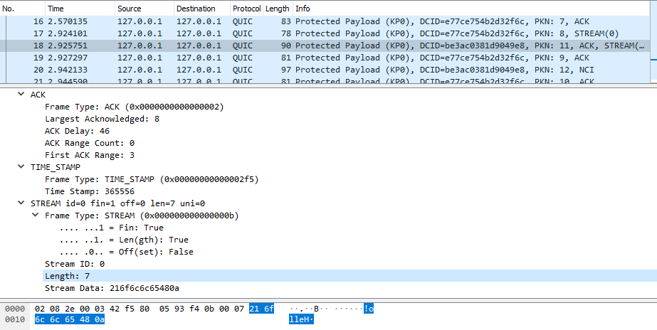

********
Tutorial
********

Code for this tutorial is available on `GitHub <https://github.com/dtikhonov/lsquic-tutorial>`_.

.. highlight:: c

Introduction
============

The LSQUIC library provides facilities for operating a QUIC (Google QUIC
or IETF QUIC) server or client with optional HTTP (or HTTP/3) functionality.
To do that, it specifies an application programming interface (API) and
exposes several basic object types to operate upon:

- engine;
- connection; and
- stream.

Engine
------

An engine manages connections, processes incoming packets, and schedules outgoing packets.  It can be instantiated in either server or client mode.  If your program needs to have both QUIC client and server functionality, instantiate two engines.  (This is what we do in our LiteSpeed ADC server.)
In addition, HTTP mode can be turned on for gQUIC and HTTP/3 support.

Connection
----------

A connection carries one or more streams, ensures reliable data delivery, and handles the protocol details.
In client mode, a connection is created using a function call, which we will cover later in the tutorial.
In server mode, by the time the user code gets a hold of the connection object, the handshake has already been completed successfully.  This is not the case in client mode.

Stream
------

A connection can have several streams in parallel and many streams during its lifetime.
Streams do not exist by themselves; they belong to a connection.  Streams are bidirectional and usually correspond to a request/response exchange - depending on the application protocol.
Application data is transmitted over streams.

HTTP Mode
---------

The HTTP support is included directly into LSQUIC.  The library hides the interaction between the HTTP application layer and the QUIC transport layer and presents a simple, unified way of sending and receiving HTTP messages.  (By "unified way," we mean between Google QUIC and HTTP/3).  Behind the scenes, the library will compress and decompress HTTP headers, add and remove HTTP/3 stream framing, and operate the necessary control streams.

In the following sections, we will describe how to:

- initialize the library;
- configure and instantiate an engine object;
- send and receive packets; and
- work with connections and streams.

Include Files
-------------

In your source files, you need to include a single header, "lsquic.h".
It pulls in an auxiliary file "lsquic_types.h".

::

    #include "lsquic.h"

Library Initialization
======================

Before the first engine object is instantiated, the library must be
initialized using :func:`lsquic_global_init()`:

::

    if (0 != lsquic_global_init(LSQUIC_GLOBAL_CLIENT|LSQUIC_GLOBAL_SERVER))
    {
        exit(EXIT_FAILURE);
    }
    /* OK, do something useful */

This will initialize the crypto library, gQUIC server certificate cache, and, depending on the platform, monotonic timers.
If you plan to instantiate engines only in a single mode, client or server,
you can omit the appropriate flag.

After all engines have been destroyed and the LSQUIC library is no longer
going to be used, the global initialization can be undone:

::

    lsquic_global_cleanup();
    exit(EXIT_SUCCESS);

Engine Instantiation
====================

Engine instantiation is performed by :func:`lsquic_engine_new()`:

::

    /* Create an engine in server mode with HTTP behavior: */
    lsquic_engine_t *engine
        = lsquic_engine_new(LSENG_SERVER|LSENG_HTTP, &engine_api);

The engine mode is selected by using the :macro:`LSENG_SERVER` flag.
If present, the engine will be in server mode; if not, the engine will
be in client mode.  If you need both server and client functionality
in your program, instantiate two engines (or as many as you like).

Using the :macro:`LSENG_HTTP` flag enables the HTTP behavior:  The library
hides the interaction between the HTTP application layer and the QUIC
transport layer and presents a simple, unified (between Google QUIC and
HTTP/3) way of sending and receiving HTTP messages.  Behind the scenes,
the library will compress and uncompress HTTP headers, add and remove
HTTP/3 stream framing, and operate the necessary control streams.

Engine Configuration
--------------------

The second argument to :func:`lsquic_engine_new()` is a pointer to
a struct of type :type:`lsquic_engine_api`.  This structure lists
several user-specified function pointers that the engine is to use
to perform various functions.  Mandatory among these are:

- function to send packets out, :member:`lsquic_engine_api.ea_packets_out`;
- functions linked to connection and stream events,
  :member:`lsquic_engine_api.ea_stream_if`;
- function to look up certificate to use, :member:`lsquic_engine_api.ea_lookup_cert` (in server mode); and
- function to fetch SSL context, :member:`lsquic_engine_api.ea_get_ssl_ctx` (optional in client mode).

The minimal structure for a client will look like this:

::

    lsquic_engine_api engine_api = {
        .ea_packets_out     = send_packets_out,
        .ea_packets_out_ctx = (void *) sockfd,  /* For example */
        .ea_stream_if       = &stream_callbacks,
        .ea_stream_if_ctx   = &some_context,
    };

Engine Settings
---------------

Engine settings can be changed by specifying
:member:`lsquic_engine_api.ea_settings`.  There are **many** parameters
to tweak: supported QUIC versions, amount of memory dedicated to connections
and streams, various timeout values, and so on.  See
:ref:`apiref-engine-settings` for full details.  If ``ea_settings`` is set
to ``NULL``, the engine will use the defaults, which should be OK.

Receiving Packets
=================

UDP datagrams are passed to the engine using the :func:`lsquic_engine_packet_in()` function.  This is the only way to do so.
A pointer to the UDP payload is passed along with the size of the payload.
Local and peer socket addresses are passed in as well.
The void "peer ctx" pointer is associated with the peer address.  It gets passed to the function that sends outgoing packets and to a few other callbacks.  In a standard setup, this is most likely the socket file descriptor, but it could be pointing to something else.
The  ECN value is in the range of 0 through 3, as in RFC 3168.

::

  /*  0: processed by real connection
   *  1: handled
   * -1: error: invalid arguments, malloc failure
   */
  int
  lsquic_engine_packet_in (lsquic_engine_t *,
      const unsigned char *udp_payload, size_t sz,
      const struct sockaddr *sa_local,
      const struct sockaddr *sa_peer,
      void *peer_ctx, int ecn);

Why specify local address
-------------------------

The local address is necessary because it becomes the source address of the outgoing packets.  This is important in a multihomed configuration, when packets arriving at a socket can have different destination addresses.  Changes in local and peer addresses are also used to detect changes in paths, such as path migration during the classic "parking lot" scenario or NAT rebinding.  When path change is detected, QUIC connection performs special steps to validate the new path.

Sending Packets
===============

The :member:`lsquic_engine_api.ea_packets_out` is the function that gets
called when an engine instance has packets to send.  It could look like
this:

::

    /* Return number of packets sent or -1 on error */
    static int
    send_packets_out (void *ctx, const struct lsquic_out_spec *specs,
                                                    unsigned n_specs)
    {
        struct msghdr msg;
        int sockfd;
        unsigned n;

        memset(&msg, 0, sizeof(msg));
        sockfd = (int) (uintptr_t) ctx;

        for (n = 0; n < n_specs; ++n)
        {
            msg.msg_name       = (void *) specs[n].dest_sa;
            msg.msg_namelen    = sizeof(struct sockaddr_in);
            msg.msg_iov        = specs[n].iov;
            msg.msg_iovlen     = specs[n].iovlen;
            if (sendmsg(sockfd, &msg, 0) < 0)
                break;
        }

        return (int) n;
    }

Note that the version above is very simple: it does not use local
address and ECN value specified in :type:`lsquic_out_spec`.
These can be set using ancillary data in a platform-dependent way.

When an error occurs
--------------------

When an error occurs, the value of ``errno`` is examined:

- ``EAGAIN`` (or ``EWOULDBLOCK``) means that the packets could not be sent and to retry later.  It is up to the caller to call :func:`lsquic_engine_send_unsent_packets()` when sending can resume.
- ``EMSGSIZE`` means that a packet was too large.  This occurs when lsquic send MTU probes.  In that case, the engine will retry sending without the offending packet immediately.
- Any other error causes the connection whose packet could not be sent to be terminated.

Outgoing Packet Specification
-----------------------------

::

  struct lsquic_out_spec
  {
      struct iovec          *iov;
      size_t                 iovlen;
      const struct sockaddr *local_sa;
      const struct sockaddr *dest_sa;
      void                  *peer_ctx;
      int                    ecn; /* 0 - 3; see RFC 3168 */
  };

Each packet specification in the array given to the "packets out" function looks like this.  In addition to the packet payload, specified via an iovec, the specification contains local and remote addresses, the peer context associated with the connection (which is just a file descriptor in tut.c), and ECN.
The reason for using iovec in the specification is that a UDP datagram may contain several QUIC packets.  QUIC packets with long headers, which are used during QUIC handshake, can be coalesced and lsquic tries to do that to reduce the number of datagrams needed to be sent.  On the incoming side, :func:`lsquic_engine_packet_in()` takes care of splitting incoming UDP datagrams into individual packets.

When to process connections
===========================

Now that we covered how to initialize the library, instantiate an engine, and send and receive packets, it is time to see how to make the engine tick.  "LSQUIC" has the concept of "tick," which is a way to describe a connection doing something productive.  Other verbs could have been "kick," "prod," "poke," and so on, but we settled on "tick."

There are several ways for a connection to do something productive.  When a connection can do any of these things, it is "tickable:"

- There are incoming packets to process
- A user wants to read from a stream and there is data that can be read
- A user wants to write to a stream and the stream is writeable
- A stream has buffered packets generated when a user has written to stream outside of the regular callback mechanism.  (This is allowed as an optimization: sometimes data becomes available and it's faster to just write to stream than to buffer it in the user code and wait for the "on write" callback.)
- Internal QUIC protocol or LSQUIC maintenance actions need to be taken, such as sending out a control frame or recycling a stream.

::

  /* Returns true if there are connections to be processed, in
   * which case `diff' is set to microseconds from current time.
   */
  int
  lsquic_engine_earliest_adv_tick (lsquic_engine_t *, int *diff);

There is a single function,
:func:`lsquic_engine_earliest_adv_tick()`, that can tell the user whether and when there is at least one connection managed by an engine that needs to be ticked.  "Adv" in the name of the function stands for "advisory," meaning that you do not have to process connections at that exact moment; it is simply recommended.  If there is a connection to be ticked, the function will return a true value and ``diff`` will be set to a relative time to when the connection is to be ticked.  This value may be negative, which means that the best time to tick the connection has passed.
The engine keeps all connections in several data structures.  It tracks each connection's timers and knows when it needs to fire.

Example with libev
------------------

::

  void
  process_conns (struct tut *tut)
  {
      ev_tstamp timeout;
      int diff;
      ev_timer_stop();
      lsquic_engine_process_conns(engine);
      if (lsquic_engine_earliest_adv_tick(engine, &diff) {
          if (diff > 0)
              timeout = (ev_tstamp) diff / 1000000;   /* To seconds */
          else
              timeout = 0.;
          ev_timer_init(timeout)
          ev_timer_start();
      }
  }

Here is a simple example that uses the libev library.  First, we stop the timer and process connections.  Then, we query the engine to tell us when the next advisory tick time is.  Based on that, we calculate the timeout to reinitialize the timer with and start the timer.
If ``diff`` is negative, we set timeout to zero.
When the timer expires (not shown here), it simply calls this ``process_conns()`` again.

Note that one could ignore the advisory tick time and simply process connections every few milliseconds and it will still work.  This, however, will result in worse performance.

Processing Connections
----------------------

Recap:
To process connections, call :func:`lsquic_engine_process_conns()`.
This will call necessary callbacks to read from and write to streams
and send packets out.  Call `lsquic_engine_process_conns()` when advised
by `lsquic_engine_earliest_adv_tick()`.

Do not call `lsquic_engine_process_conns()` from inside callbacks, for
this function is not reentrant.

Another function that sends packets is
:func:`lsquic_engine_send_unsent_packets()`.  Call it if there was a
previous failure to send out all packets

Required Engine Callbacks
=========================

Now we continue to initialize our engine instance.  We have covered the callback to send out packets.  This is one of the required engine callbacks.
Other required engine callbacks are a set of stream and connection callbacks that get called on various events in then connections and stream lifecycles and a callback to get the default TLS context.

::

  struct lsquic_engine_api engine_api = {
    /* --- 8< --- snip --- 8< --- */
    .ea_stream_if       = &stream_callbacks,
    .ea_stream_if_ctx   = &some_context,
    .ea_get_ssl_ctx     = get_ssl_ctx,
  };

Optional Callbacks
------------------

Here we mention some optional callbacks.  While they are not covered by
this tutorial, it is good to know that they are available.

- Looking up certificate and TLS context by SNI.
- Callbacks to control memory allocation for outgoing packets.  These are useful when sending packets using a custom library.  For example, when all packets must be in contiguous memory.
- Callbacks to observe connection ID lifecycle.  These are useful in multi-process applications.
- Callbacks that provide access to a shared-memory hash.  This is also used in multi-process applications.
- HTTP header set processing.  These callbacks may be used in HTTP mode for HTTP/3 and Google QUIC.

Please refer to :ref:`apiref-engine-settings` for details.

Stream and connection callbacks
===============================

Stream and connection callbacks are the way that the library communicates with user code.  Some of these callbacks are mandatory; others are optional.
They are all collected in :type:`lsquic_stream_if` ("if" here stands
for "interface").
The mandatory callbacks include calls when connections and streams are created and destroyed and callbacks when streams can be read from or written to.
The optional callbacks are used to observe some events in the connection lifecycle, such as being informed when handshake has succeeded (or failed) or when a goaway signal is received from peer.

::

  struct lsquic_stream_if
  {
      /* Mandatory callbacks: */
      lsquic_conn_ctx_t *(*on_new_conn)(void *stream_if_ctx,
                                                          lsquic_conn_t *c);
      void (*on_conn_closed)(lsquic_conn_t *c);
      lsquic_stream_ctx_t *
           (*on_new_stream)(void *stream_if_ctx, lsquic_stream_t *s);
      void (*on_read)     (lsquic_stream_t *s, lsquic_stream_ctx_t *h);
      void (*on_write)    (lsquic_stream_t *s, lsquic_stream_ctx_t *h);
      void (*on_close)    (lsquic_stream_t *s, lsquic_stream_ctx_t *h);

      /* Optional callbacks: */
      void (*on_goaway_received)(lsquic_conn_t *c);
      void (*on_hsk_done)(lsquic_conn_t *c, enum lsquic_hsk_status s);
      void (*on_new_token)(lsquic_conn_t *c, const unsigned char *token,
      void (*on_sess_resume_info)(lsquic_conn_t *c, const unsigned char *, size_t);
  };

On new connection
-----------------

When a connection object is created, the "on new connection" callback is called.  In server mode, the handshake is already known to have succeeded; in client mode, the connection object is created before the handshake is attempted.  The client can tell when handshake succeeds or fails by relying on the optional "handshake is done" callback or the "on connection close" callback.

::

  /* Return pointer to per-connection context.  OK to return NULL. */
  static lsquic_conn_ctx_t *
  my_on_new_conn (void *ea_stream_if_ctx, lsquic_conn_t *conn)
  {
      struct some_context *ctx = ea_stream_if_ctx;
      struct my_conn_ctx *my_ctx = my_ctx_new(ctx);
      if (ctx->is_client)
          /* Need a stream to send request */
          lsquic_conn_make_stream(conn);
      return (void *) my_ctx;
  }

In the made-up example above, a new per-connection context is allocated and returned.  This context is then associated with the connection and can be retrieved using a dedicated function.  Note that it is OK to return a ``NULL`` pointer.
Note that in client mode, this is a good place to request that the connection make a new stream by calling :func:`lsquic_conn_make_stream()`.  The connection will create a new stream when handshake succeeds.

On new stream
-------------

QUIC allows either endpoint to create streams and send and receive data on them.  There are unidirectional and bidirectional streams.  Thus, there are four stream types.  In our tutorial, however, we use the familiar paradigm of the client sending requests to the server using bidirectional stream.

On the server, new streams are created when client requests arrive.  On the client, streams are created when possible after the user code has requested stream creation by calling :func:`lsquic_conn_make_stream()`.

::

  /* Return pointer to per-connection context.  OK to return NULL. */
  static lsquic_stream_ctx_t *
  my_on_new_stream (void *ea_stream_if_ctx, lsquic_stream_t *stream) {
      struct some_context *ctx = ea_stream_if_ctx;
      /* Associate some data with this stream: */
      struct my_stream_ctx *stream_ctx
                    = my_stream_ctx_new(ea_stream_if_ctx);
      stream_ctx->stream = stream;
      if (ctx->is_client)
          lsquic_stream_wantwrite(stream, 1);
      return (void *) stream_ctx;
  }

In a pattern similar to the "on new connection" callback, a per-stream context can be created at this time.  The function returns this context and other stream callbacks - "on read," "on write," and "on close" - will be passed a pointer to it.  As before, it is OK to return ``NULL``.
You can register an interest in reading from or writing to the stream by using a "want read" or "want write" function.  Alternatively, you can simply read or write; be prepared that this may fail and you have to try again in the "regular way."  We talk about that next.

On read
-------

When the "on read" callback is called, there is data to be read from stream, end-of-stream has been reached, or there is an error.

::

  static void
  my_on_read (lsquic_stream_t *stream, lsquic_stream_ctx_t *h) {
      struct my_stream_ctx *my_stream_ctx = (void *) h;
      unsigned char buf[BUFSZ];

      ssize_t nr = lsquic_stream_read(stream, buf, sizeof(buf));
      /* Do something with the data.... */
      if (nr == 0) /* EOF */ {
          lsquic_stream_shutdown(stream, 0);
          lsquic_stream_wantwrite(stream, 1); /* Want to reply */
      }
  }

To read the data or to collect the error, call :func:`lsquic_stream_read`.  If a negative value is returned, examine ``errno``.  If it is not ``EWOULDBLOCK``, then an error has occurred, and you should close the stream.  Here, an error means an application error, such as peer resetting the stream.  A protocol error or an internal library error (such as memory allocation failure) lead to the connection being closed outright.
To reiterate, the "on read" callback is called only when the user has registered interest in reading from the stream.

On write
--------

The "on write" callback is called when the stream can be written to.  At this point, you should be able to write at least a byte to the stream.
As with the "on read" callback, for this callback to be called, the user must have registered interest in writing to stream using :func:`lsquic_stream_wantwrite()`.

::

  static void
  my_on_write (lsquic_stream_t *stream, lsquic_stream_ctx_t *h) {
      struct my_stream_ctx *my_stream_ctx = (void *) h;
      ssize_t nw = lsquic_stream_write(stream,
          my_stream_ctx->resp, my_stream_ctx->resp_sz);
      if (nw == my_stream_ctx->resp_sz)
          lsquic_stream_close(stream);
  }

By default, "on read" and "on write" callbacks will be called in a loop as long as there is data to read or the stream can be written to.  If you are done reading from or writing to stream, you should either shut down the appropriate end, close the stream, or unregister your interest.  The library implements a circuit breaker to stop would-be infinite loops when no reading or writing progress is made.  Both loop dispatch and the circuit breaker are configurable (see :member:`lsquic_engine_settings.es_progress_check` and :member:`lsquic_engine_settings.es_rw_once`).

On stream close
---------------

When reading and writing ends of the stream have been closed, the "on close" callback is called.  After this function returns, pointers to the stream become invalid.  (The library destroys the stream object when it deems proper.)
This is a good place to perform necessary cleanup.

::

  static void
  my_on_close (lsquic_stream_t *stream, lsquic_stream_ctx_t *h) {
      lsquic_conn_t *conn = lsquic_stream_conn(stream);
      struct my_conn_ctx *my_ctx = lsquic_conn_get_ctx(conn);
      if (!has_more_reqs_to_send(my_ctx)) /* For example */
          lsquic_conn_close(conn);
      free(h);
  }

In the made-up example above, we free the per-stream context allocated in the "on new stream" callback and we may close the connection.

On connection close
-------------------

When either :func:`lsquic_conn_close()` has been called; or the peer has closed the connection; or an error has occurred, the "on connection close" callback is called.  At this point, it is time to free the per-connection context, if any.

::

  static void
  my_on_conn_closed (lsquic_conn_t *conn) {
      struct my_conn_ctx *my_ctx = lsquic_conn_get_ctx(conn);
      struct some_context *ctx = my_ctx->some_context;

      --ctx->n_conns;
      if (0 == ctx->n_conn && (ctx->flags & CLOSING))
          exit_event_loop(ctx);

      free(my_ctx);
  }

In the example above, you see the call to :func:`lsquic_conn_get_ctx()`.  This returns the pointer returned by the "on new connection" callback.

Using Streams
=============

To reduce buffering, most of the time bytes written to stream are written into packets directly.  Bytes are buffered in the stream until a full packet can be created.  Alternatively, one could flush the data by calling :func:`lsquic_stream_flush`.
It is impossible to write more data than the congestion window.  This prevents excessive buffering inside the library.
Inside the "on read" and "on write" callbacks, reading and writing should succeed.  The exception is error collection inside the "on read" callback.
Outside of the callbacks, be ready to handle errors.  For reading, it is -1 with ``EWOULDBLOCK`` errno.  For writing, it is the return value of 0.

More stream functions
---------------------

Here are a few more useful stream functions.

::

  /* Flush any buffered data.  This triggers packetizing even a single
   * byte into a separate frame.
   */
  int
  lsquic_stream_flush (lsquic_stream_t *);

  /* Possible values for how are 0, 1, and 2.  See shutdown(2). */
  int
  lsquic_stream_shutdown (lsquic_stream_t *, int how);

  int
  lsquic_stream_close (lsquic_stream_t *);

As mentioned before, calling :func:`lsquic_stream_flush()` will cause the stream to packetize the buffered data.  Note that it may not happen immediately, as there may be higher-priority writes pending or there may not be sufficient congestion window to do so.  Calling "flush" only schedules writing to packets.

:func:`lsquic_stream_shutdown()` and :func:`lsquic_stream_close()` mimic the interface of the "shutdown" and "close" socket functions.  After both read and write ends of a stream are closed, the "on stream close" callback will soon be called.

Stream return values
--------------------

The stream read and write functions are modeled on the standard UNIX read and write functions, including the use of the ``errno``.  The most important of these error codes are ``EWOULDBLOCK`` and ``ECONNRESET`` because you may encounter these even if you structure your code correctly.  Other errors typically occur when the user code does something unexpected.

Return value of 0 is different for reads and writes.  For reads, it means that EOF has been reached and you need to stop reading from the stream.  For writes, it means that you should try writing later.

If writing to stream returns an error, it may mean an internal error.  If the error is not recoverable, the library will abort the connection; if it is recoverable (the only recoverable error is failure to allocate memory), attempting to write later may succeed.

Scatter/gather stream functions
-------------------------------

There is the scatter/gather way to read from and write to stream and the interface is similar to the usual "readv" and "writev" functions.  All return values and error codes are the same as in the stream read and write functions we have just discussed.  Those are actually just wrappers around the scatter/gather versions.

::

  ssize_t
  lsquic_stream_readv (lsquic_stream_t *, const struct iovec *,
                                                    int iovcnt);
  ssize_t
  lsquic_stream_writev (lsquic_stream_t *, const struct iovec *,
                                                        int count);

Read using a callback
---------------------

The scatter/gather functions themselves are also wrappers.  LSQUIC provides stream functions that skip intermediate buffering.  They are used for zero-copy stream processing.

::

  ssize_t
  lsquic_stream_readf (lsquic_stream_t *,
    size_t (*readf)(void *ctx, const unsigned char *, size_t len, int fin),
    void *ctx);

The second argument to :func:`lsquic_stream_readf()` is a callback that
returns the number of bytes processed.  The callback is passed:

- Pointer to user-supplied context;
- Pointer to the data;
- Data size (can be zero); and
- Indicator whether the FIN follows the data.

If callback returns 0 or value smaller than `len`, reading stops.

Read with callback: Example 1
-----------------------------

Here is the first example of reading from stream using a callback.  Now the process of reading from stream
is split into two functions.

::

  static void
  tut_client_on_read_v1 (lsquic_stream_t *stream, lsquic_stream_ctx_t *h)
  {
    struct tut *tut = (struct tut *) h;
    size_t nread = lsquic_stream_readf(stream, tut_client_readf_v1, NULL);
    if (nread == 0)
    {
        LOG("read to end-of-stream: close and read from stdin again");
        lsquic_stream_shutdown(stream, 0);
        ev_io_start(tut->tut_loop, &tut->tut_u.c.stdin_w);
    }
    /* ... */
  }

Here, we see the :func:`lsquic_stream_readf()` call.  The return value is the same as the other read functions.
Because in this example there is no extra information to pass to the callback (we simply print data to stdout),
the third argument is NULL.

::

  static size_t
  tut_client_readf_v1 (void *ctx, const unsigned char *data,
                                                    size_t len, int fin)
  {
      if (len)
      {
          fwrite(data, 1, len, stdout);
          fflush(stdout);
      }
      return len;
  }

Here is the callback itself.  You can see it is very simple.  If there is data to be processed,
it is printed to stdout.

Note that the data size (``len`` above) can be anything.  It is not limited by UDP datagram size.  This is because when incoming STREAM frames pass some fragmentation threshold, LSQUIC begins to copy incoming STREAM data to a data structure that is impervious to stream fragmentation attacks.  Thus, it is possible for the callback to pass a pointer to data that is over 3KB in size.  The implementation may change, so again, no guarantees.
When the fourth argument, ``fin``, is true, this indicates that the incoming data ends after ``len`` bytes have been read.

Read with callback: Example 2: Use FIN
--------------------------------------

The FIN indicator passed to the callback gives us yet another way to detect end-of-stream.
The previous version checked the return value of :func:`lsquic_stream_readf()` to check for EOS.
Instead, we can use ``fin`` in the callback.

The second zero-copy read example is a little more efficient as it saves us
an extra call to ``tut_client_on_read_v2``.
Here, we package pointers to the tut struct and stream into a special struct and pass it to
``lsquic_stream_readf()``.

::

  struct client_read_v2_ctx { struct tut *tut; lsquic_stream_t *stream; };

  static void
  tut_client_on_read_v2 (lsquic_stream_t *stream,
                                              lsquic_stream_ctx_t *h)
  {
    struct tut *tut = (struct tut *) h;
    struct client_read_v2_ctx v2ctx = { tut, stream, };
    ssize_t nread = lsquic_stream_readf(stream, tut_client_readf_v2,
                                                                &v2ctx);
    if (nread < 0)
      /* ERROR */
  }

Now the callback becomes more complicated, as we moved the logic to stop reading from stream into it.  We need pointer to both stream and user context when "fin" is true.  In that case, we call :func:`lsquic_stream_shutdown()` and begin reading from stdin again to grab the next line of input.

::

  static size_t
  tut_client_readf_v2 (void *ctx, const unsigned char *data,
                                                size_t len, int fin)
  {
    struct client_read_v2_ctx *v2ctx = ctx;
    if (len)
      fwrite(data, 1, len, stdout);
    if (fin)
    {
      fflush(stdout);
      LOG("read to end-of-stream: close and read from stdin again");
      lsquic_stream_shutdown(v2ctx->stream, 0);
      ev_io_start(v2ctx->tut->tut_loop, &v2ctx->tut->tut_u.c.stdin_w);
    }
    return len;
  }

Writing to stream: Example 1
----------------------------

Now let's consider writing to stream.

::

  static void
  tut_server_on_write_v0 (lsquic_stream_t *stream, lsquic_stream_ctx_t *h)
  {
    struct tut_server_stream_ctx *const tssc = (void *) h;
    ssize_t nw = lsquic_stream_write(stream,
        tssc->tssc_buf + tssc->tssc_off, tssc->tssc_sz - tssc->tssc_off);
    if (nw > 0)
    {
        tssc->tssc_off += nw;
        if (tssc->tssc_off == tssc->tssc_sz)
            lsquic_stream_close(stream);
    /* ... */
  }

Here, we call :func:`lsquic_stream_write()` directly.  If writing succeeds and we reached the
end of the buffer we wanted to write, we close the stream.

Write using callbacks
---------------------

To write using a callback, we need to use :func:`lsquic_stream_writef()`.

::

  struct lsquic_reader {
    /* Return number of bytes written to buf */
    size_t (*lsqr_read) (void *lsqr_ctx, void *buf, size_t count);
    /* Return number of bytes remaining in the reader.  */
    size_t (*lsqr_size) (void *lsqr_ctx);
    void    *lsqr_ctx;
  };

  /* Return umber of bytes written or -1 on error. */
  ssize_t
  lsquic_stream_writef (lsquic_stream_t *, struct lsquic_reader *);

We must specify not only the function that will perform the copy, but also the function that will return the number of bytes remaining.  This is useful in situations where the size of the data source may change.  For example, an underlying file may change size.
The :member:`lsquic_reader.lsqr_read` callback will be called in a loop until stream can write no more or until :member:`lsquic_reader.lsqr_size` returns zero.
The return value of ``lsquic_stream_writef`` is the same as :func:`lsquic_stream_write()` and :func:`lsquic_stream_writev()`, which are just wrappers around the "writef" version.

Writing to stream: Example 2
----------------------------

Here is the second version of the "on write" callback.  It uses :func:`lsquic_stream_writef()`.

::

  static void
  tut_server_on_write_v1 (lsquic_stream_t *stream, lsquic_stream_ctx_t *h)
  {
      struct tut_server_stream_ctx *const tssc = (void *) h;
      struct lsquic_reader reader = { tssc_read, tssc_size, tssc, };
      ssize_t nw = lsquic_stream_writef(stream, &reader);
      if (nw > 0 && tssc->tssc_off == tssc->tssc_sz)
          lsquic_stream_close(stream);
      /* ... */
  }

The reader struct is initialized with pointers to read and size functions and this struct is passed
to the "writef" function.

::

  static size_t
  tssc_size (void *ctx)
  {
    struct tut_server_stream_ctx *tssc = ctx;
    return tssc->tssc_sz - tssc->tssc_off;
  }

The size callback simply returns the number of bytes left.

::

  static size_t
  tssc_read (void *ctx, void *buf, size_t count)
  {
    struct tut_server_stream_ctx *tssc = ctx;

    if (count > tssc->tssc_sz - tssc->tssc_off)
      count = tssc->tssc_sz - tssc->tssc_off;
    memcpy(buf, tssc->tssc_buf + tssc->tssc_off, count);
    tssc->tssc_off += count;
    return count;
  }

The read callback (so called because you *read* data from the source) writes no more than ``count`` bytes
to memory location pointed by ``buf`` and returns the number of bytes copied.
In our case, ``count`` is never larger than the number of bytes still left to write.
This is because the caller - the LSQUIC library - gets the value of ``count`` from the ``lsqr_size()`` callback.  When reading from a file descriptor, on the other hand, this can very well happen that you don't have as much data to write as you thought you had.

Client: making connection
=========================

We now switch our attention to making a QUIC connection.  The function :func:`lsquic_engine_connect()` does that.  This function has twelve arguments.  (These arguments have accreted over time.)

::

  lsquic_conn_t *
  lsquic_engine_connect (lsquic_engine_t *,
        enum lsquic_version, /* Set to N_LSQVER for default */
        const struct sockaddr *local_sa,
        const struct sockaddr *peer_sa,
        void *peer_ctx,
        lsquic_conn_ctx_t *conn_ctx,
        const char *hostname,         /* Used for SNI */
        unsigned short base_plpmtu, /* 0 means default */
        const unsigned char *sess_resume, size_t sess_resume_len,
        const unsigned char *token, size_t token_sz);

- The first argument is the pointer to the engine instance.
- The second argument is the QUIC version to use.
- The third and fourth arguments specify local and destination addresses, respectively.
- The fifth argument is the so-called "peer context."
- The sixth argument is the connection context.  This is used if you need to pass a pointer to the "on new connection" callback.  This context is overwritten by the return value of the "on new connection" callback.
- The argument "hostname," which is the seventh argument, is used for SNI.  This argument is optional, just as the rest of the arguments that follow.
- The eighth argument is the initial maximum size of the UDP payload.  This will be the base PLPMTU if DPLPMTUD is enabled.  Specifying zero, or default, is the safe way to go: lsquic will pick a good starting value.
- The next two arguments allow one to specify a session resumption information to establish a connection faster.  In the case of IETF QUIC, this is the TLS Session Ticket.  To get this ticket, specify the :member:`lsquic_stream_if.on_sess_resume_info` callback.
- The last pair of arguments is for specifying a token to try to prevent a potential stateless retry from the server.  The token is learned in a previous session.  See the optional callback :member:`lsquic_stream_if.on_new_token`.

::

    tut.tut_u.c.conn = lsquic_engine_connect(
        tut.tut_engine, N_LSQVER,
        (struct sockaddr *) &tut.tut_local_sas, &addr.sa,
        (void *) (uintptr_t) tut.tut_sock_fd,  /* Peer ctx */
        NULL, NULL, 0, NULL, 0, NULL, 0);
    if (!tut.tut_u.c.conn)
    {
        LOG("cannot create connection");
        exit(EXIT_FAILURE);
    }
    tut_process_conns(&tut);

Here is an example from a tutorial program.  The connect call is a lot less intimidating in real life, as half the arguments are set to zero.
We pass a pointer to the engine instance, N_LSQVER to let the engine pick the version to use and the two socket addresses.
The peer context is simply the socket file descriptor cast to a pointer.
This is what is passed to the "send packets out" callback.

Specifying QUIC version
=======================

QUIC versions in LSQUIC are gathered in an enum, :type:`lsquic_version`, and have an arbitrary value.

::

  enum lsquic_version {
      LSQVER_043, LSQVER_046, LSQVER_050,     /* Google QUIC */
      LSQVER_ID27, LSQVER_ID28, LSQVER_ID29,  /* IETF QUIC */
      /* ...some special entries skipped */
      N_LSQVER    /* <====================== Special value */
  };

The special value "N_LSQVER" is used to let the engine pick the QUIC version.
It picks the latest non-experimental version, so in this case it picks ID-29.
(Experimental from the point of view of the library.)

Because version enum values are small -- and that is by design -- a list of
versions can be passed around as bitmasks.

::

  /* This allows list of versions to be specified as bitmask: */
  es_versions = (1 << LSQVER_ID28) | (1 << LSQVER_ID29);

This is done, for example, when
specifying list of versions to enable in engine settings using :member:`lsquic_engine_api.ea_versions`.
There are a couple of more places in the API where this technique is used.

Server callbacks
================

The server requires SSL callbacks to be present.  The basic required callback is :member:`lsquic_engine_api.ea_get_ssl_ctx`.  It is used to get a pointer to an initialized ``SSL_CTX``.

::

  typedef struct ssl_ctx_st * (*lsquic_lookup_cert_f)(
      void *lsquic_cert_lookup_ctx, const struct sockaddr *local,
      const char *sni);

  struct lsquic_engine_api {
    lsquic_lookup_cert_f   ea_lookup_cert;
    void                  *ea_cert_lu_ctx;
    struct ssl_ctx_st *  (*ea_get_ssl_ctx)(void *peer_ctx,
                                            const struct sockaddr *local);
    /* (Other members of the struct are not shown) */
  };

In case SNI is used, LSQUIC will call :member:`lsquic_engine_api.ea_lookup_cert`.
For example, SNI is required in HTTP/3.
In `our web server`_, each virtual host has its own SSL context.  Note that besides the SNI string, the callback is also given the local socket address.  This makes it possible to implement a flexible lookup mechanism.

Engine settings
===============

Besides the engine API struct passed to the engine constructor, there is also an engine settings struct, :type:`lsquic_engine_settings`.  :member:`lsquic_engine_api.ea_settings` in the engine API struct
can be pointed to a custom settings struct.  By default, this pointer is ``NULL``.
In that case, the engine uses default settings.

There are many settings, controlling everything from flow control windows to the number of times an "on read" callback can be called in a loop before it is deemed an infinite loop and the circuit breaker is tripped.  To make changing default settings values easier, the library provides functions to initialize the settings struct to defaults and then to check these values for sanity.

Settings helper functions
-------------------------

::

  /* Initialize `settings' to default values */
  void
  lsquic_engine_init_settings (struct lsquic_engine_settings *,
    /* Bitmask of LSENG_SERVER and LSENG_HTTP */
                               unsigned lsquic_engine_flags);

  /* Check settings for errors, return 0 on success, -1 on failure. */
  int
  lsquic_engine_check_settings (const struct lsquic_engine_settings *,
                                unsigned lsquic_engine_flags,
                                /* Optional, can be NULL: */
                                char *err_buf, size_t err_buf_sz);

The first function is :func:`lsquic_engine_init_settings()`, which does just that.
The second argument is a bitmask to specify whether the engine is in server mode
and whether HTTP mode is turned on.  These should be the same flags as those
passed to the engine constructor.

Once you have initialized the settings struct in this manner, change the setting
or settings you want and then call :func:`lsquic_engine_check_settings()`.  The
first two arguments are the same as in the initializer.  The third and fourth
argument are used to pass a pointer to a buffer into which a human-readable error
string can be placed.

The checker function does only the basic sanity checks.  If you really set out
to misconfigure LSQUIC, you can.  On the bright side, each setting is clearly
documented (see :ref:`apiref-engine-settings`).  Most settings are standalone;
when there is interplay between them, it is also documented.
Test before deploying!

Settings example
----------------

The example is adapted from a tutorial program.  Here, command-line options
are processed and appropriate options is set.  The first time the ``-o``
flag is encountered, the settings struct is initialized.  Then the argument
is parsed to see which setting to alter.

::

  while (/* getopt */)
  {
      case 'o':   /* For example: -o version=h3-27 -o cc_algo=2 */
        if (!settings_initialized) {
          lsquic_engine_init_settings(&settings,
                          cert_file || key_file ? LSENG_SERVER : 0);
          settings_initialized = 1;
        }
        /* ... */
        else if (0 == strncmp(optarg, "cc_algo=", val - optarg))
          settings.es_cc_algo = atoi(val);
      /* ... */
  }

  /* Check settings */
  if (0 != lsquic_engine_check_settings(&settings,
                  tut.tut_flags & TUT_SERVER ? LSENG_SERVER : 0,
                  errbuf, sizeof(errbuf)))
  {
    LOG("invalid settings: %s", errbuf);
    exit(EXIT_FAILURE);
  }

  /* ... */
  eapi.ea_settings = &settings;

After option processing is completed, the settings are checked.  The error
buffer is used to log a configuration error.

Finally, the settings struct is pointed to by the engine API struct before
the engine constructor is called.

Logging
=======

LSQUIC provides a simple logging interface using a single callback function.
By default, no messages are logged.  This can be changed by calling :func:`lsquic_logger_init()`.
This will set a library-wide logger callback function.

::

  void lsquic_logger_init(const struct lsquic_logger_if *,
      void *logger_ctx, enum lsquic_logger_timestamp_style);

  struct lsquic_logger_if {
    int (*log_buf)(void *logger_ctx, const char *buf, size_t len);
  };

  enum lsquic_logger_timestamp_style { LLTS_NONE, LLTS_HHMMSSMS,
      LLTS_YYYYMMDD_HHMMSSMS, LLTS_CHROMELIKE, LLTS_HHMMSSUS,
      LLTS_YYYYMMDD_HHMMSSUS, N_LLTS };

You can instruct the library to generate a timestamp and include it as part of the message.
Several timestamp formats are available.  Some display microseconds, some do not; some
display the date, some do not.  One of the most useful formats is "chromelike,"
which matches the somewhat weird timestamp format used by Chromium.  This makes it easy to
compare the two logs side by side.

There are eight log levels in LSQUIC: debug, info, notice, warning, error, alert, emerg,
and crit.
These correspond to the usual log levels.  (For example, see ``syslog(3)``).  Of these, only five are used: debug, info, notice, warning, and error.  Usually, warning and error messages are printed when there is a bug in the library or something very unusual has occurred.  Memory allocation failures might elicit a warning as well, to give the operator a heads up.

LSQUIC possesses about 40 logging modules.  Each module usually corresponds to a single piece
of functionality in the library.  The exception is the "event" module, which logs events of note in many modules.
There are two functions to manipulate which log messages will be generated.

::

  /* Set log level for all modules */
  int
  lsquic_set_log_level (const char *log_level);

  /* Set log level per module "event=debug" */
  int
  lsquic_logger_lopt (const char *optarg);

The first is :func:`lsquic_set_log_level()`.  It sets the same log level for each module.
The second is :func:`lsquic_logger_lopt()`.  This function takes a comma-separated list of name-value pairs.  For example, "event=debug."

Logging Example
---------------

The following example is adapted from a tutorial program.  In the program, log messages
are written to a file handle.  By default, this is the standard error.  One can change
that by using the "-f" command-line option and specify the log file.

::

  static int
  tut_log_buf (void *ctx, const char *buf, size_t len) {
    FILE *out = ctx;
    fwrite(buf, 1, len, out);
    fflush(out);
    return 0;
  }
  static const struct lsquic_logger_if logger_if = { tut_log_buf, };

  lsquic_logger_init(&logger_if, s_log_fh, LLTS_HHMMSSUS);

``tut_log_buf()`` returns 0, but the truth is that the return value is ignored.
There is just nothing for the library to do when the user-supplied log function fails!

::

  case 'l':   /* e.g. -l event=debug,cubic=info */
    if (0 != lsquic_logger_lopt(optarg)) {
        fprintf(stderr, "error processing -l option\n");
        exit(EXIT_FAILURE);
    }
    break;
  case 'L':   /* e.g. -L debug */
    if (0 != lsquic_set_log_level(optarg)) {
        fprintf(stderr, "error processing -L option\n");
        exit(EXIT_FAILURE);
    }
    break;

Here you can see how we use ``-l`` and ``-L`` command-line options to call one of
the two log level functions.  These functions can fail if the incorrect log level
or module name is passed.  Both log level and module name are treated in case-insensitive manner.

Sample log messages
-------------------

When log messages are turned on, you may see something like this in your log file (timestamps and
log levels are elided for brevity):

.. code-block:: text

    [QUIC:B508E8AA234E0421] event: generated STREAM frame: stream 0, offset: 0, size: 3, fin: 1
    [QUIC:B508E8AA234E0421-0] stream: flushed to or past required offset 3
    [QUIC:B508E8AA234E0421] event: sent packet 13, type Short, crypto: forw-secure, size 32, frame types: STREAM, ecn: 0, spin: 0; kp: 0, path: 0, flags: 9470472
    [QUIC:B508E8AA234E0421] event: packet in: 15, type: Short, size: 44; ecn: 0, spin: 0; path: 0
    [QUIC:B508E8AA234E0421] rechist: received 15
    [QUIC:B508E8AA234E0421] event: ACK frame in: [13-9]
    [QUIC:B508E8AA234E0421] conn: about to process QUIC_FRAME_STREAM frame
    [QUIC:B508E8AA234E0421] event: STREAM frame in: stream 0; offset 0; size 3; fin: 1
    [QUIC:B508E8AA234E0421-0] stream: received stream frame, offset 0x0, len 3; fin: 1
    [QUIC:B508E8AA234E0421-0] di: FIN set at 3

Here we see the connection ID, ``B508E8AA234E0421``, and logging for modules "event", "stream", "rechist"
(that stands for "receive history"), "conn", and "di" (the "data in" module).  When the connection ID is
followed by a dash and that number, the number is the stream ID.  Note that stream ID is logged not just
for the stream, but for some other modules as well.

Key logging and Wireshark
=========================

`Wireshark`_ supports IETF QUIC.  The developers have been very good at keeping up with latest versions.
You will need version 3.3 of Wireshark to support Internet-Draft 29.  Support for HTTP/3 is in progress.

To export TLS secrets, use BoringSSL's ``SSL_CTX_set_keylog_callback()``.
Use `lsquic_ssl_to_conn()` to get the connection associated
with the SSL object.

Key logging example
-------------------

::

    static void *
    keylog_open_file (const SSL *ssl)
    {
        const lsquic_conn_t *conn;
        const lsquic_cid_t *cid;
        FILE *fh;
        int sz;
        unsigned i;
        char id_str[MAX_CID_LEN * 2 + 1];
        char path[PATH_MAX];
        static const char b2c[16] = "0123456789ABCDEF";

        conn = lsquic_ssl_to_conn(ssl);
        cid = lsquic_conn_id(conn);
        for (i = 0; i < cid->len; ++i)
        {
            id_str[i * 2 + 0] = b2c[ cid->idbuf[i] >> 4 ];
            id_str[i * 2 + 1] = b2c[ cid->idbuf[i] & 0xF ];
        }
        id_str[i * 2] = '\0';
        sz = snprintf(path, sizeof(path), "/secret_dir/%s.keys", id_str);
        if ((size_t) sz >= sizeof(path))
        {
            LOG("WARN: %s: file too long", __func__);
            return NULL;
        }
        fh = fopen(path, "ab");
        if (!fh)
            LOG("WARN: could not open %s for appending: %s", path, strerror(errno));
        return fh;
    }

    static void
    keylog_log_line (const SSL *ssl, const char *line)
    {
        file = keylog_open_file(ssl);
        if (file)
        {
            fputs(line, file);
            fputs("\n", file);
            fclose(file);
        }
    }

    /* ... */

    SSL_CTX_set_keylog_callback(ssl, keylog_log_line);

The most involved part of this is opening the necessary file, creating it if necessary.
The connection can be used to generate a filename based on the connection ID.
We see that the line logger simply writes the passed C string to the filehandle and appends a newline.

Wireshark screenshot
--------------------

After jumping through those hoops, our reward is a decoded QUIC trace in Wireshark!

Here, we highlighted the STREAM frame payload.
Other frames in view are ACK and TIMESTAMP frames.
In the top panel with the packet list, you can see that frames are listed after the packet number.
Another interesting item is the DCID.  This stands for "Destination Connection ID," and you can
see that there are two different values there.  This is because the two peers of the QUIC connection
place different connection IDs in the packets!

Connection IDs
==============

A QUIC connection has two sets of connection IDs: source connection IDs and destination connection IDs.  The source connection IDs set is what the peer uses to place in QUIC packets; the destination connection IDs is what this endpoint uses to include in the packets it sends to the peer.  One's source CIDs is the other's destination CIDs and vice versa.
What interesting is that either side of the QUIC connection may change the DCID.  Use CIDs with care.

::

    #define MAX_CID_LEN 20

    typedef struct lsquic_cid
    {
        uint_fast8_t    len;
        union {
            uint8_t     buf[MAX_CID_LEN];
            uint64_t    id;
        }               u_cid;
    #define idbuf u_cid.buf
    } lsquic_cid_t;

    #define LSQUIC_CIDS_EQ(a, b) ((a)->len == 8 ? \
        (b)->len == 8 && (a)->u_cid.id == (b)->u_cid.id : \
        (a)->len == (b)->len && 0 == memcmp((a)->idbuf, (b)->idbuf, (a)->len))

The LSQUIC representation of a CID is the struct above.  The CID can be up to 20 bytes in length.
By default, LSQUIC uses 8-byte CIDs to speed up comparisons.

Get this-and-that API
=====================

Here are a few functions to get different LSQUIC objects from other objects.

::

    const lsquic_cid_t *
    lsquic_conn_id (const lsquic_conn_t *);

    lsquic_conn_t *
    lsquic_stream_conn (const lsquic_stream_t *);

    lsquic_engine_t *
    lsquic_conn_get_engine (lsquic_conn_t *);

    int lsquic_conn_get_sockaddr (lsquic_conn_t *,
          const struct sockaddr **local, const struct sockaddr **peer);

The CID returned by :func:`lsquic_conn_id()` is that used for logging: server and client should return the same CID.  As noted earlier, you should not rely on this value to identify a connection!
You can get a pointer to the connection from a stream and a pointer to the engine from a connection.
Calling :func:`lsquic_conn_get_sockaddr()` will point ``local`` and ``peer`` to the socket addressess of the current path.  QUIC supports multiple paths during migration, but access to those paths has not been exposed via an API yet.  This may change when or if QUIC adds true multipath support.

.. _`our web server`: https://www.litespeedtech.com/products
.. _`Wireshark`: https://www.wireshark.org/
